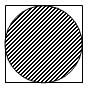
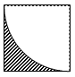
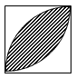

<!-- question-source:start -->
【练习 4】 1、如图所示，图形中正方形的面积是50平方厘米，分别求出每个图形中阴影部分的面积。

2、如图所示，图形中正方形的面积是50平方厘米，分别求出每个图形中阴影部分的面积。
3、如图所示，正方形中对角$\frac{}{}$线长10厘米，过正方形两个相对的顶点以其边长为半径分别做弧。求图形中阴影部分的面积（试一试，你能想出几种办法）。

<!-- question-source:end -->

![[小学/奥数/小学奥数举一反三六年级/第20讲_面积计算(三)/练习/answers/Q00094572A1.md]]
