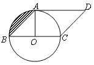
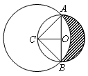
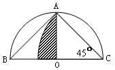

<!-- question-source:start -->
【练习 5】 1、如图所示，平行四边形的面积是100平方厘米，求阴影部分的面积。

2、如图所示，O是小圆的圆心，CO垂直于AB,三角形ABC的面积是45平方厘米，求阴影部分的面积。
3、如图所示，半圆的面积是62.8平方厘米，求阴影部分的面积。

<!-- question-source:end -->

![[小学/奥数/小学奥数举一反三六年级/第20讲_面积计算(三)/练习/answers/Q00094573A1.md]]
