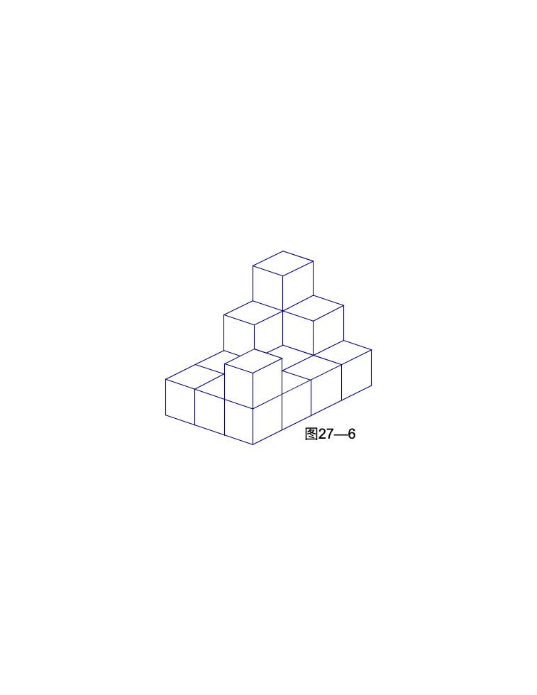

<!-- question-source:start -->
【练习 2】 1、用棱长是1厘米的立方体拼成图27-6所示的立体图形。求这个立体图形的表面积。

2、一堆积木（如图27-7所示），是由16块棱长是2厘米的小正方体堆成的。它们的表面积是多少平方厘米？
图27－7
3、一个正方体的表面积是384平方厘米，把这个正方体平均分割成64个相等的小正方体。每个小正方体的表面积是多少平方厘米？
<!-- question-source:end -->

![[小学/奥数/小学奥数举一反三六年级/第27讲_表面积与体积(一)/练习/answers/Q00094640A1.md]]
