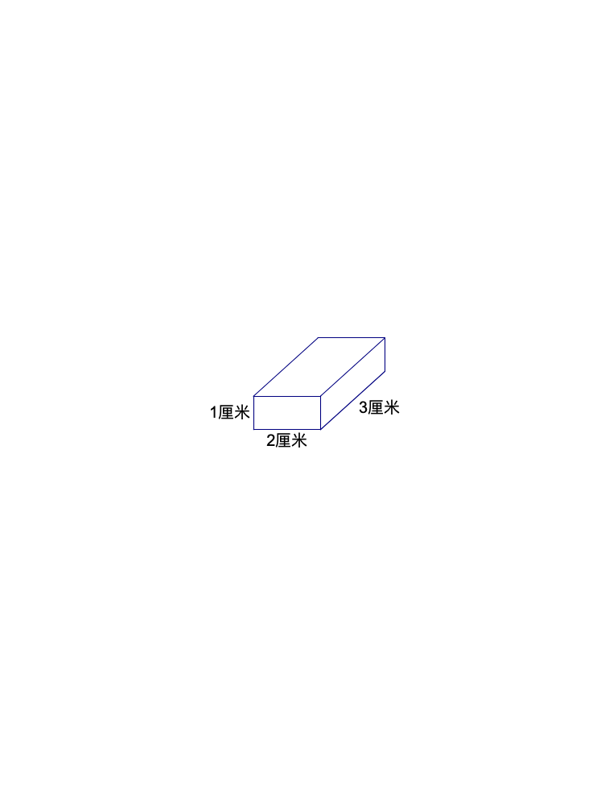

<!-- question-source:start -->
【练习 3】 1、把底面积为20平方厘米的两个相等的正方体拼成一个长方体，长方体的表面积是多少？
2、将一个表面积为30平方厘米的正方体等分成两个长方体，再将这两个长方体拼成一个大长方体。求大长方体的表面积是多少。
3、用6块（如图27-8所示）长方体木块拼成一个大长方体，有许多种做法，其中表面积最小的是多少平方厘米？

图27-8
<!-- question-source:end -->

![[小学/奥数/小学奥数举一反三六年级/第27讲_表面积与体积(一)/练习/answers/Q00094641A1.md]]
