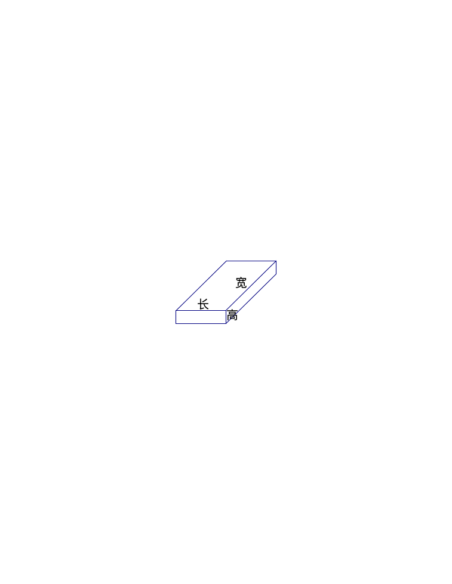

<!-- question-source:start -->
【练习 4】 1、一个长方体，如果长减少2厘米，则体积减少48立方厘米；如果宽增加5厘米，则体积增加65立方厘米；如果高增加4厘米，则体积增加96立方厘米。原来厂房体的表面积是多少平方厘米？
2、一个厂房体木块，从下部和上部分别截去高为3厘米和2厘米的长方体后，便成为一个正方体，其表面积减少了120平方厘米。原来厂房体的体积是多少立方厘米？
3、有一个厂房体如下图所示，它的正面和上面的面积之和是209。如果它的长、宽、高都是质数，这个长方体的体积是多少？

图27－9

<!-- question-source:end -->

![[小学/奥数/小学奥数举一反三六年级/第27讲_表面积与体积(一)/练习/answers/Q00094642A1.md]]
