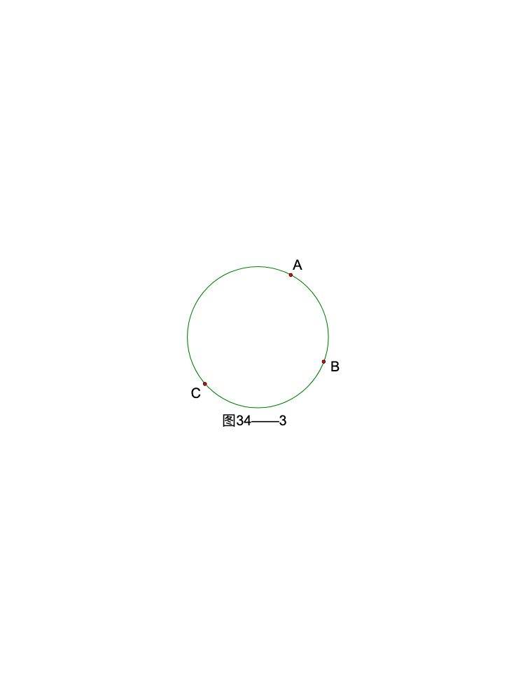
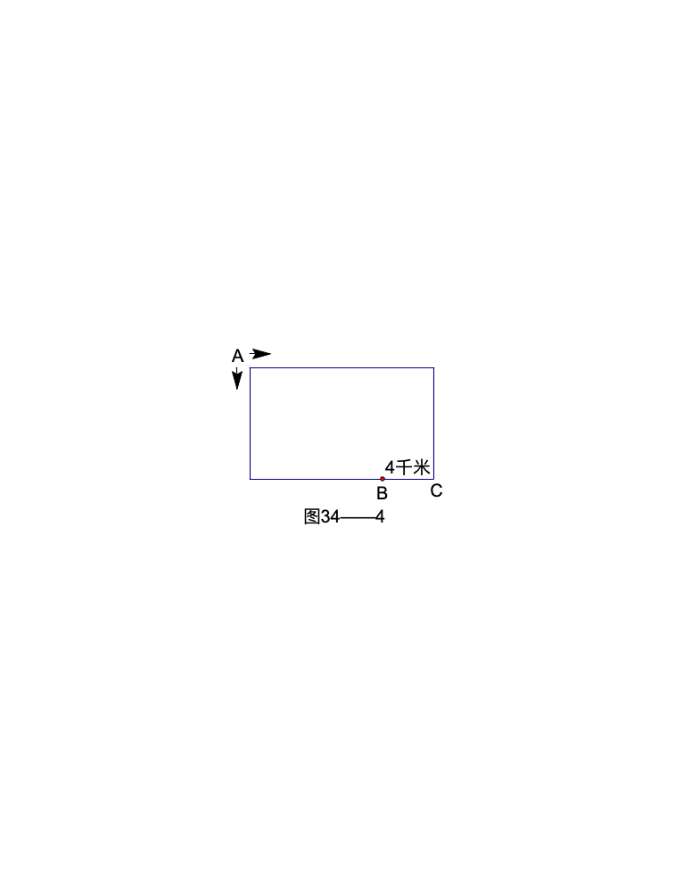

<!-- question-source:start -->
【练习 2】 1、小明绕一个圆形长廊游玩。顺时针走，从A处到C处要12分钟，从B处到A处要15分钟，从C处到B处要11分钟。从A处到B处需要多少分钟（如图34-3所示）？

图34-3 图34-4
2、摩托车与小汽车同时从A地出发，沿长方形的路两边行驶，结果在B地相遇。已知B地与C地的距离是4千米。且小汽车的速度为摩托车速度的。这条长方形路的全长是多少千米（如图34-4所示）？
3、甲、乙两人在圆形跑道上，同时从某地出发沿相反方向跑步。甲速是乙速的3倍，他们第一次与第二次相遇地点之间的路程是100米。环形跑道有多少米？
<!-- question-source:end -->

![[小学/奥数/小学奥数举一反三六年级/第34讲_行程问题(二)/练习/answers/Q00094710A1.md]]
