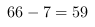

<!-- question-source:start -->
【练习 1】 1、一堆火柴40根，甲、乙两人轮流去拿，谁拿到最后一根谁胜。每人每次可以拿1至3根，不许不拿，乙让甲先拿。问：谁能一定取胜？他要取胜应采取什么策略？
2、两人轮流报数，规定每次报的数都是不超过8的自然数，把两人报的数累加起来，谁先报到88，谁就获胜。问：先报数者有必胜的策略吗？
3、把1994个空格排成一排，第一格中放一枚棋子，甲、乙两人轮流移动棋子，每人每次可后移1格、2格、3格，谁先移到最后一格谁胜。先移者确保获胜的方法是什么？
2、能报的数有1,2,3,4,5,6\
∴,如果66是胜利,则也是胜利\
因为对方1,你就6,对方2,你就5,以此类推.\
于是,3是第一个必胜点.10是第二个,以此类推.\
就看谁抢到这些数字\
直接就报3则必胜
3、
解：因为，1994个空格，走到终点需要1993步(起点不算)，\
(1994-1)÷(1+3)=498...1，先移者第一次向右移1格，以后每一轮保证向右移的格数与对方加起来是4格，由此，先移者胜．故
<!-- question-source:end -->

![[小学/奥数/小学奥数举一反三六年级/第37讲_对策问题/练习/answers/Q00094739A1.md]]
