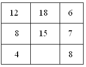

# 第02讲 找规律（二）

## 一、知识要点

对于较复杂的按规律填数的问题，我们可以从以下几个方面来思考：
1.对于几列数组成的一组数变化规律的分析，需要我们灵活地思考，没有一成不变的方法，有时需要综合运用其他知识，一种方法不行，就要及时调整思路，换一种方法再分析；
2.对于那些分布在某些图中的数，它们之间的变化规律往往与这些数在图形中的特殊位置有关，这是我们解这类题的突破口。
3.对于找到的规律，应该适合这组数中的所有数或这组算式中的所有算式。

## 二、精讲精练

### 典型例题

![[小学/奥数/小学奥数举一反三四年级/第02讲_找规律(二)/例题/Q00093584.md]]
![[小学/奥数/小学奥数举一反三四年级/第02讲_找规律(二)/例题/Q00093585.md]]
![[小学/奥数/小学奥数举一反三四年级/第02讲_找规律(二)/例题/Q00093586.md]]
![[小学/奥数/小学奥数举一反三四年级/第02讲_找规律(二)/例题/Q00093587.md]]
![[小学/奥数/小学奥数举一反三四年级/第02讲_找规律(二)/例题/Q00093588.md]]

### 配套练习

![[小学/奥数/小学奥数举一反三四年级/第02讲_找规律(二)/练习/Q00093589.md]]
![[小学/奥数/小学奥数举一反三四年级/第02讲_找规律(二)/练习/Q00093590.md]]
![[小学/奥数/小学奥数举一反三四年级/第02讲_找规律(二)/练习/Q00093591.md]]
![[小学/奥数/小学奥数举一反三四年级/第02讲_找规律(二)/练习/Q00093592.md]]
![[小学/奥数/小学奥数举一反三四年级/第02讲_找规律(二)/练习/Q00093593.md]]
