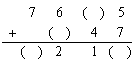

# 第05讲 算式谜（一）

## 一、知识要点

"算式谜"一般是指那些含有未知数字或缺少运算符号的算式。解决这类问题，可以根据已学过的知识，运用正确的分析推理方法，确定算式中的未知数字和运用符号。由于这类题目的解答过程类似全平时进行的猜谜语游戏，所以，我们把这类题目称为"算式谜题"。
解答算式谜问题时，要先仔细审题，分析数据之间的关系，找到突破口，逐步试验，分析求解，通常要运用倒推法、凑整法、估值法等。

## 二、精讲精练

### 典型例题

![[小学/奥数/小学奥数举一反三四年级/第05讲_算式谜(一)/例题/Q00093614.md]]
![[小学/奥数/小学奥数举一反三四年级/第05讲_算式谜(一)/例题/Q00093615.md]]
![[小学/奥数/小学奥数举一反三四年级/第05讲_算式谜(一)/例题/Q00093616.md]]
![[小学/奥数/小学奥数举一反三四年级/第05讲_算式谜(一)/例题/Q00093617.md]]
![[小学/奥数/小学奥数举一反三四年级/第05讲_算式谜(一)/例题/Q00093618.md]]

### 配套练习

![[小学/奥数/小学奥数举一反三四年级/第05讲_算式谜(一)/练习/Q00093619.md]]
![[小学/奥数/小学奥数举一反三四年级/第05讲_算式谜(一)/练习/Q00093620.md]]
![[小学/奥数/小学奥数举一反三四年级/第05讲_算式谜(一)/练习/Q00093621.md]]
![[小学/奥数/小学奥数举一反三四年级/第05讲_算式谜(一)/练习/Q00093622.md]]
![[小学/奥数/小学奥数举一反三四年级/第05讲_算式谜(一)/练习/Q00093623.md]]
