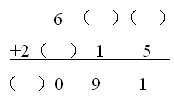
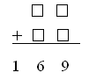

<!-- question-source:start -->
【练习 1】 （1）在括号里填上合适的数。 （2）在方框里填上合适的数。
     
（3）下面的竖式里，有4个数字被遮住了，求竖式中被盖住的4个数字的和。
<!-- question-source:end -->

![[小学/奥数/小学奥数举一反三四年级/第05讲_算式谜(一)/练习/answers/Q00093619A1.md]]
