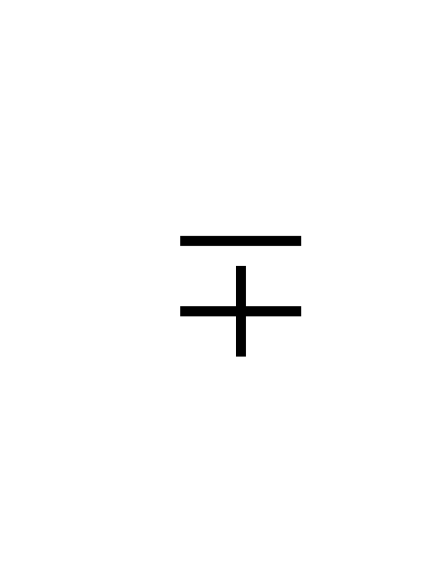

# 第09讲 变化规律（一）

## 一、知识要点

和、差的规律见下表（m≠0）
  ------------------- ----------------------------------------------------------------------------------------- -------------------
     一个加数（a）                                         另一个加数（b）                                            和（c）
          ±m                                                    不变                                                    ±m
         不变                                                    ±m                                                     ±m
          ±m           m         不变
  ------------------- ----------------------------------------------------------------------------------------- -------------------
  ------------------- ------------------- -----------------------------------------------------------------------------------------
      被减数（a）          减数（b）                                               差（c）
          ±m                 不变                                                    ±m
         不变                 ±m           m
          ±m                  ±m                                                    不变
  ------------------- ------------------- -----------------------------------------------------------------------------------------

## 二、精讲精练

### 典型例题

![[小学/奥数/小学奥数举一反三四年级/第09讲_变化规律(一)/例题/Q00093654.md]]
![[小学/奥数/小学奥数举一反三四年级/第09讲_变化规律(一)/例题/Q00093655.md]]
![[小学/奥数/小学奥数举一反三四年级/第09讲_变化规律(一)/例题/Q00093656.md]]
![[小学/奥数/小学奥数举一反三四年级/第09讲_变化规律(一)/例题/Q00093657.md]]
![[小学/奥数/小学奥数举一反三四年级/第09讲_变化规律(一)/例题/Q00093658.md]]

### 配套练习

![[小学/奥数/小学奥数举一反三四年级/第09讲_变化规律(一)/练习/Q00093659.md]]
![[小学/奥数/小学奥数举一反三四年级/第09讲_变化规律(一)/练习/Q00093660.md]]
![[小学/奥数/小学奥数举一反三四年级/第09讲_变化规律(一)/练习/Q00093661.md]]
![[小学/奥数/小学奥数举一反三四年级/第09讲_变化规律(一)/练习/Q00093662.md]]
![[小学/奥数/小学奥数举一反三四年级/第09讲_变化规律(一)/练习/Q00093663.md]]
