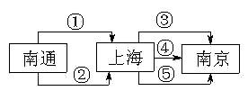

# 第12讲 简单列举

## 一、知识要点

有些题目，因其所求问题的答案有多种，直接列式解答比较困难，在这种情况下，我们不妨采用一一列举的方法解决。这种根据题目的要求，通过一一列举各种情况最终达到解答整个问题的方法叫做列举法。

## 二、精讲精练

### 典型例题

![[小学/奥数/小学奥数举一反三四年级/第12讲_简单列举/例题/Q00093684.md]]
![[小学/奥数/小学奥数举一反三四年级/第12讲_简单列举/例题/Q00093685.md]]
![[小学/奥数/小学奥数举一反三四年级/第12讲_简单列举/例题/Q00093686.md]]
![[小学/奥数/小学奥数举一反三四年级/第12讲_简单列举/例题/Q00093687.md]]
![[小学/奥数/小学奥数举一反三四年级/第12讲_简单列举/例题/Q00093688.md]]

### 配套练习

![[小学/奥数/小学奥数举一反三四年级/第12讲_简单列举/练习/Q00093689.md]]
![[小学/奥数/小学奥数举一反三四年级/第12讲_简单列举/练习/Q00093690.md]]
![[小学/奥数/小学奥数举一反三四年级/第12讲_简单列举/练习/Q00093691.md]]
![[小学/奥数/小学奥数举一反三四年级/第12讲_简单列举/练习/Q00093692.md]]
![[小学/奥数/小学奥数举一反三四年级/第12讲_简单列举/练习/Q00093693.md]]
