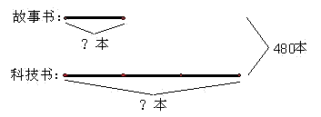

# 第13讲 和倍问题

## 一、知识要点

已知两个数的和与它们之间的倍数关系，求这两个数是多少的应用题，叫做和倍问题。解答和倍应用题的基本数量关系是：
和÷（倍数＋1）=小数
小数×倍数=大数
（和－小数=大数）

## 二、精讲精练

### 典型例题

![[小学/奥数/小学奥数举一反三四年级/第13讲_和倍问题/例题/Q00093694.md]]
![[小学/奥数/小学奥数举一反三四年级/第13讲_和倍问题/例题/Q00093695.md]]
![[小学/奥数/小学奥数举一反三四年级/第13讲_和倍问题/例题/Q00093696.md]]
![[小学/奥数/小学奥数举一反三四年级/第13讲_和倍问题/例题/Q00093697.md]]
![[小学/奥数/小学奥数举一反三四年级/第13讲_和倍问题/例题/Q00093698.md]]

### 配套练习

![[小学/奥数/小学奥数举一反三四年级/第13讲_和倍问题/练习/Q00093699.md]]
![[小学/奥数/小学奥数举一反三四年级/第13讲_和倍问题/练习/Q00093700.md]]
![[小学/奥数/小学奥数举一反三四年级/第13讲_和倍问题/练习/Q00093701.md]]
![[小学/奥数/小学奥数举一反三四年级/第13讲_和倍问题/练习/Q00093702.md]]
![[小学/奥数/小学奥数举一反三四年级/第13讲_和倍问题/练习/Q00093703.md]]
