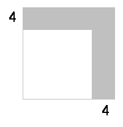

<!-- question-source:start -->
【练习 4】 1.有一个正方形的水池，如下图的阴影部分，在它的周围修一个宽8米的花池，花池的面积是480平方米，求水池的边长。 
2.四个完全相同的长方形和一个小正方形拼成了一个大正方形（如图），大正方形的面积是64平方米，小正方形的面积是4平方米，长方形的短边是多少米？
3.已知大正方形比小正方形的边长多4厘米，大正方形的面积比小正方形面积大96平方厘米（如下图）。问大小正方形的面积各是多少？
<!-- question-source:end -->

![[小学/奥数/小学奥数举一反三四年级/第15讲_图形问题/练习/answers/Q00093722A1.md]]
