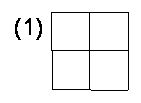

> [!faq]- 《小学奥数举一反三(四年级)》例题解析
>
> > [!note]- **【思路导航】**
> > 图中边长为1个长度单位的正方形有3×3=9个，边长为2个长度单位的正方形有2×2=4个，边长为3个长度单位的正方形有1×1=1个。所以图中的正方形总数为：1+4+9=14个。
> > 经进一步分析可以发现，由相同的n×n个小方格组成的几行几列的正方形其中所含的正方形总数为：1×1＋2×2＋...＋n×n。
> > 
