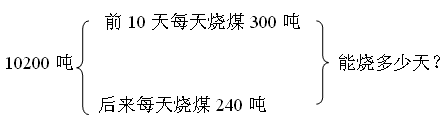

> [!faq]- 《小学奥数举一反三(四年级)》例题解析
>
> > [!note]- **【思路导航】**
> > 条件摘录
> > 
> > 综合法思路：
> > 前10天每天烧煤300吨，可以求出10天烧的吨数；
> > 已知煤的总吨数和前10天烧的吨数，可以求出还有多少吨没有烧；
> > 根据还剩的吨数和后来每天烧煤240吨，可以求出这堆煤还能烧多少天。
> > 分析法思路：
> > 要求还能烧多少天，要知道还有的吨数和后来每天烧的吨数（240吨）；
> > 要求还有多少吨煤，要知道这堆煤有多少吨（10200吨）和已经烧了多少吨。
> > 要求已经烧了多少吨，要知道已经烧了多少天（10天）和每天烧多少吨（300吨）。
> > （10200－300×10）÷240=30（天）.
