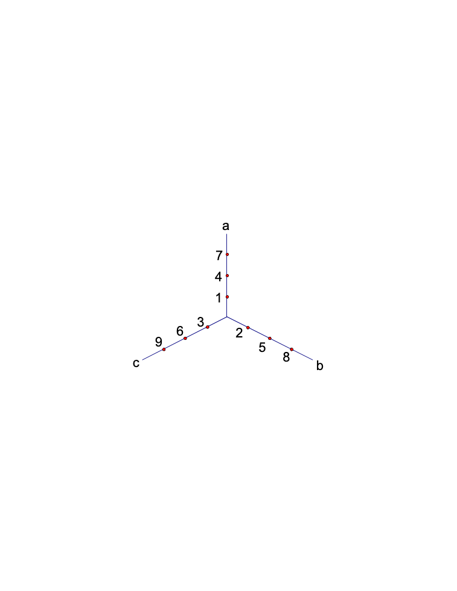

<!-- question-source:start -->
【练习 3】 1，有a、b、c三条直线，从a线开始，从1起依次在三条直线上写数（如下图），22、59、2001各在哪一条线上？

2，假设所有自然数如下图排列起来，36、43、78、2000应分别排在哪个字母下面？
A B C D
1 2 3 4
8 7 6 5
9 10 11 12
...
3，2001个学生按下列方法编号排成五列：
一 二 三 四 五
1 2 3 4 5
9 8 7 6
10 11 12 13
17 16 15 14
...
问：最后一个学生应该排在第几列？
<!-- question-source:end -->

![[小学/奥数/小学奥数举一反三四年级/第28讲_周期问题/练习/answers/Q00093851A1.md]]
