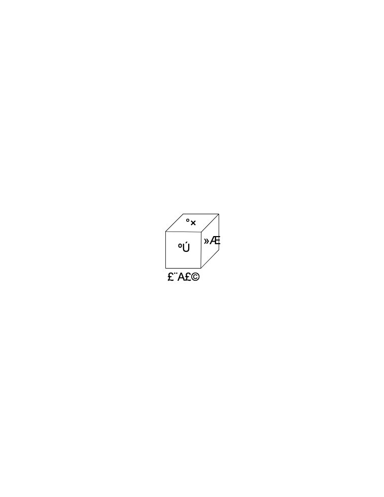
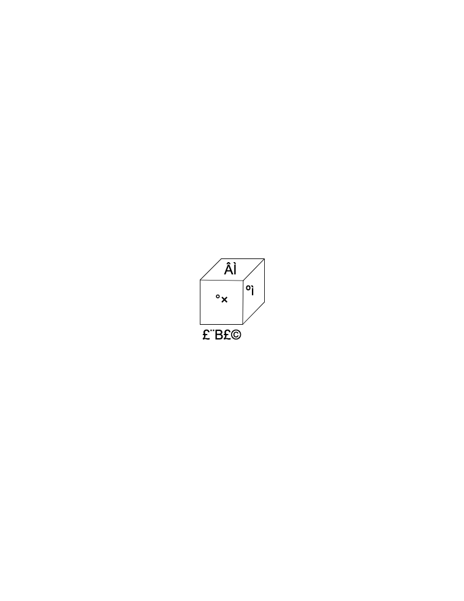
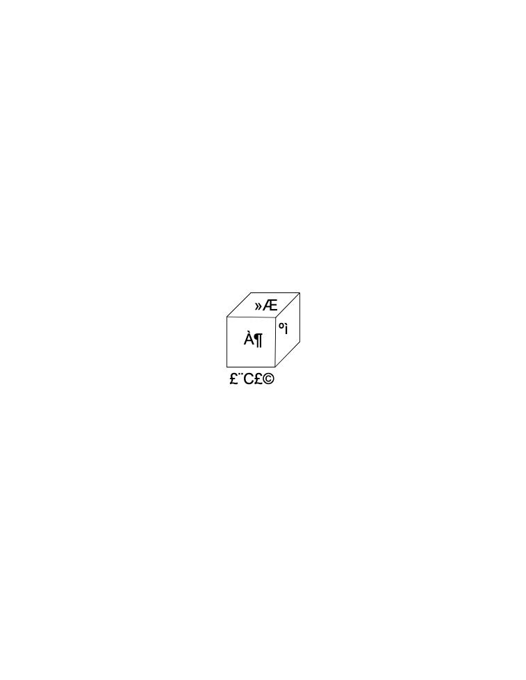
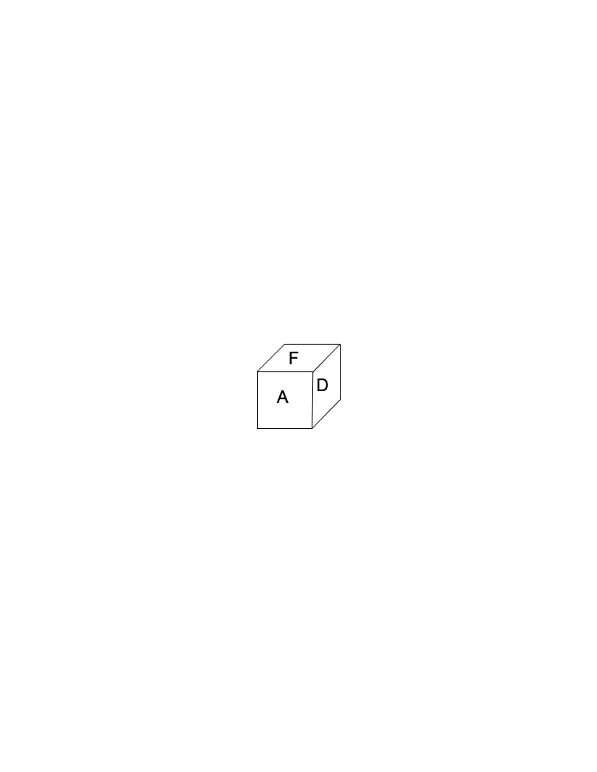
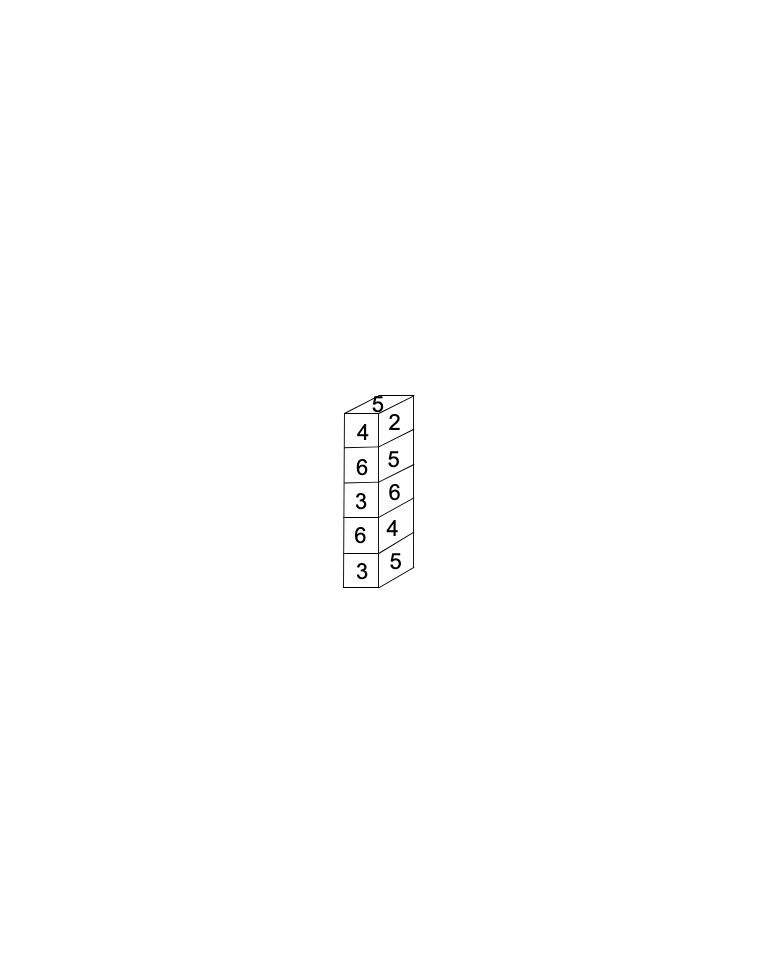

<!-- question-source:start -->
【练习 2】 1，下面三块正方体的六个面都是按相同的规律涂有红、黄、蓝、白、绿、黑六种颜色。请判断黄色的对面是什么颜色？白色的对面是什么颜色？红色的对面是什么颜色？

2，一个正方体，六个面分别写上A、B、C、D、E、F，你能根据这个正方体不同的摆法，求出相对的两个面的字母是什么吗？

3，五个相同的正方体木块，按相同的顺序在上面写上数字1\~6，把木块叠成下图，那么，2的对面是几？4的对面是几？5的对面是几？

<!-- question-source:end -->

![[小学/奥数/小学奥数举一反三四年级/第32讲_逻辑推理/练习/answers/Q00093890A1.md]]
