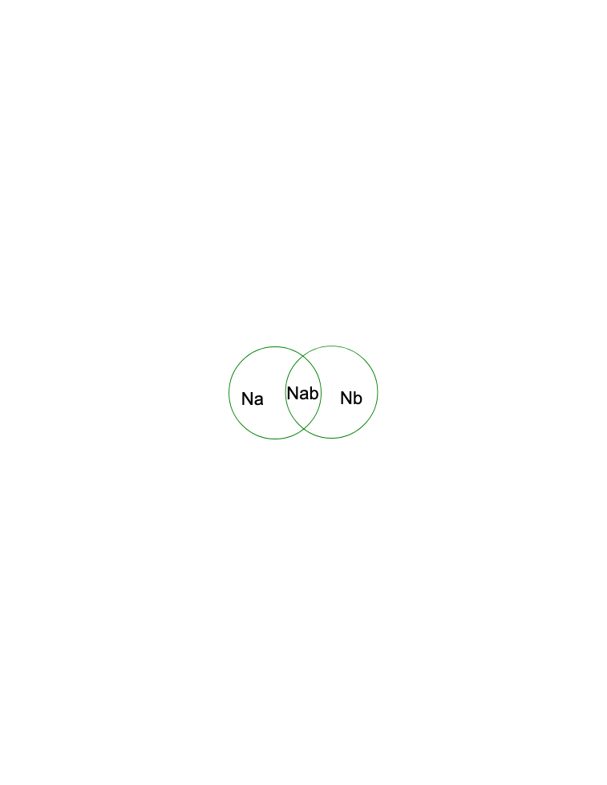

# 第35讲 容斥原理

## 一、知识要点

容斥问题涉及到一个重要原理------包含与排除原理，也叫容斥原理。即当两个计数部分有重复包含时，为了不重复计数，应从它们的和中排除重复部分。
容斥原理：对n个事物，如果采用不同的分类标准，按性质a分类与性质b分类（如图），那么具有性质a或性质b的事物的个数=N~a~＋N~b~－N~ab~。

## 二、精讲精练

### 典型例题

![[小学/奥数/小学奥数举一反三四年级/第35讲_容斥原理/例题/Q00093914.md]]
![[小学/奥数/小学奥数举一反三四年级/第35讲_容斥原理/例题/Q00093915.md]]
![[小学/奥数/小学奥数举一反三四年级/第35讲_容斥原理/例题/Q00093916.md]]
![[小学/奥数/小学奥数举一反三四年级/第35讲_容斥原理/例题/Q00093917.md]]
![[小学/奥数/小学奥数举一反三四年级/第35讲_容斥原理/例题/Q00093918.md]]

### 配套练习

![[小学/奥数/小学奥数举一反三四年级/第35讲_容斥原理/练习/Q00093919.md]]
![[小学/奥数/小学奥数举一反三四年级/第35讲_容斥原理/练习/Q00093920.md]]
![[小学/奥数/小学奥数举一反三四年级/第35讲_容斥原理/练习/Q00093921.md]]
![[小学/奥数/小学奥数举一反三四年级/第35讲_容斥原理/练习/Q00093922.md]]
![[小学/奥数/小学奥数举一反三四年级/第35讲_容斥原理/练习/Q00093923.md]]
