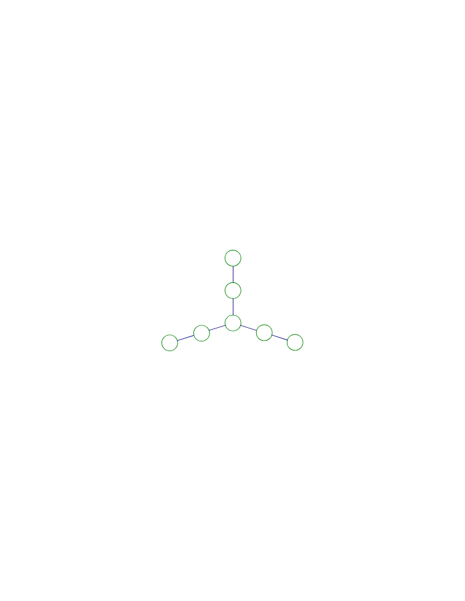

<!-- question-source:start -->
【练习 2】 1，把1 \~
5五个数分别填入图中的五个圆圈内，使每条直线上三个圆圈内各数的和是10。

2，把3 \~
7五个数分别填入图中的五个圆圈内，使每条直线上三个圆圈内各数的和相等而且最大。

3，把1 \~
7七个数分别填入图中的七个圆圈内，使每条直线上三个圆圈内各数之和相等。

<!-- question-source:end -->

![[小学/奥数/小学奥数举一反三四年级/第40讲_数学开放题/练习/answers/Q00093970A1.md]]
