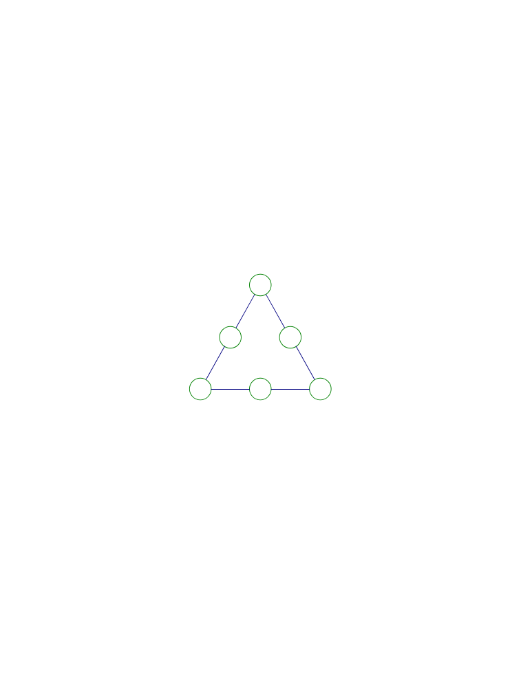
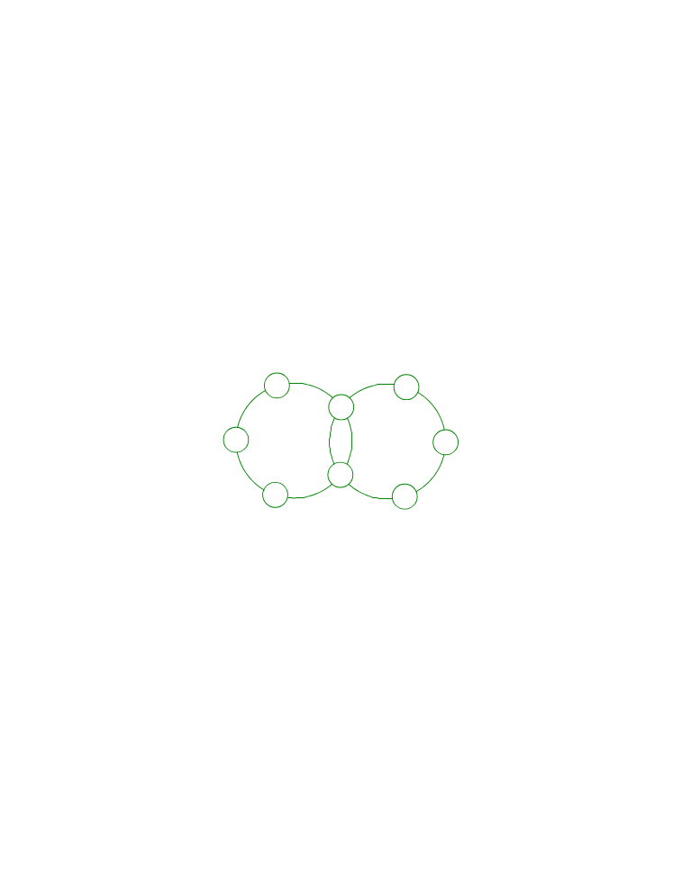
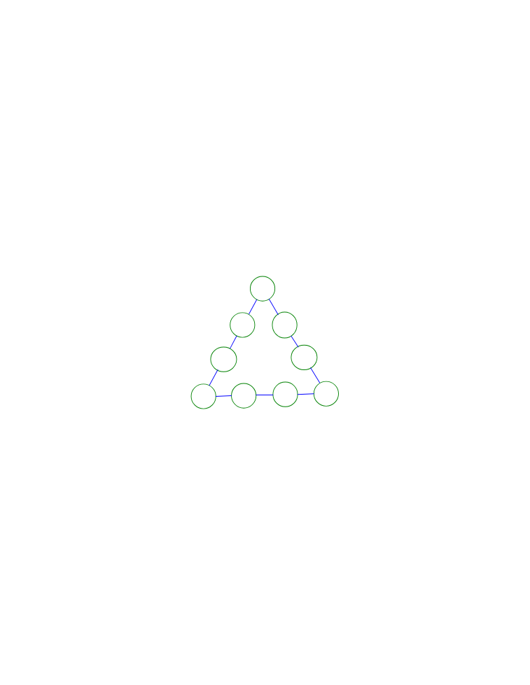

<!-- question-source:start -->
【练习 3】 1，把1 \~
6六个数分别填入图中的六个圆圈中，使每条边上三个数的和都等于12。

2，把1 \~
8八个数分别填入图中的八个圆圈中，使每个圆圈上五个数的和都等于21。

3，把1 \~
9这九个数分别填入图中的九个圆圈中，使每条边上四个数的和相等而且最小。

<!-- question-source:end -->

![[小学/奥数/小学奥数举一反三四年级/第40讲_数学开放题/练习/answers/Q00093971A1.md]]
