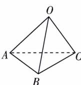

<!-- question-source:start -->
6. 如图所示, 在空间四边形 OABC 中, OB = OC, 且 $\angle AOB = \angle AOC = \frac{\pi}{3}$ , 则 $\cos\langle\overrightarrow{OA},\overrightarrow{BC}\rangle$ 的值为( )

A. $\frac{\sqrt{3}}{3}$ B. 0 C. $\frac{1}{2}$ D. $\frac{\sqrt{2}}{2}$

√ 答案 P100
<!-- question-source:end -->

![[Q00003444A1]]
