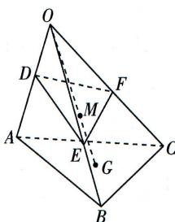

<!-- question-source:start -->
6. 如图, 在三棱锥 O-ABC 中, 点 G 为底面 $\triangle ABC$ 的重心, 点 M 是线段 OG 上靠近点 G 的三等分点, 过点 M 的平面分别交棱 OA, OB, OC 于点 D, E, F. 若 $\overrightarrow{OD} = k \overrightarrow{OA}, \overrightarrow{OE} = m \overrightarrow{OB}, \overrightarrow{OF} = n \overrightarrow{OC}$ , 则 $\frac{1}{k} + \frac{1}{m} + \frac{1}{n} =$ A. $\frac{13}{3}$ B. $\frac{2}{3}$ C. $\frac{3}{2}$

$$
\begin{array}{c} \frac {9}{2} \end{array}
$$
<!-- question-source:end -->

![[Q00003471A1]]
