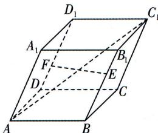

<!-- question-source:start -->
7.[北京海淀区2025高二期中]如图,平行六面体 $ABCD-A_{1}B_{1}C_{1}D_{1}$ 的所有棱长均为2,AB,AD, $AA_{1}$ 两两所成夹角均为 $\frac{\pi}{3}$ ,点

E,F 分别在棱 $BB_{1}, DD_{1}$ 上, 且 $BE = 2B_{1}E$ , $D_{1}F = 2DF$ , 则 $|\overrightarrow{EF}| =$ \_\_\_\_ ; 直线 $AC_{1}$ 与 EF 所成角的余弦值为 \_\_\_\_.
<!-- question-source:end -->

![[Q00003472A1]]
