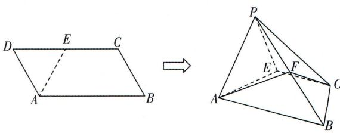

<!-- question-source:start -->
4.[黑龙江哈尔滨九中2025高二期末]如图,在平行四边形ABCD中, $AB=2BC=2,\angle ABC=60^{\circ},E$ 为CD的中点,沿AE将 $\triangle DAE$ 翻折至 $\triangle PAE$ 的位置,得到四棱锥P-ABCE,F为线段PB上一动点.

√ 答案 P122

(1) 若 F 为 PB 的中点, 证明: 在翻折过程中均有 CF//平面 PAE.

(2) 若 PB = 2,

①证明:平面 PAE ⊥ 平面 ABCE;

②当动点 F 到平面 PCE 的距离为 $\frac{\sqrt{15}}{10}$ 时, 求 $\frac{PF}{PB}$ 的值.

<!-- question-source:end -->

![[Q00003586A1]]
