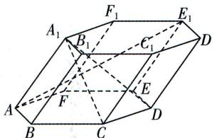

<!-- question-source:start -->
12.[河北唐山2025高二期中]如图,在六棱柱 $ABCDEF-A_{1}B_{1}C_{1}D_{1}E_{1}F_{1}$ 中,底面ABCDEF是正六边形,设 $\overrightarrow{AB}=a,\overrightarrow{AF}=b,\overrightarrow{AA_{1}}=c.$ 若 $\cos\angle BAA_{1}=\cos\angle FAA_{1}=\frac{1}{4},AB=2,AA_{1}=4.$ (1)试用向量 a,b,c 表示 $\overrightarrow{A_{1}D},\overrightarrow{A_{1}C}$ ，并求 $\overrightarrow{A_{1}C}\cdot\overrightarrow{A_{1}D}$ 的值；
(2) 求 $|\overrightarrow{AE_{1}}|$ .

<!-- question-source:end -->

![[Q00003505A1]]
