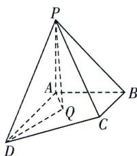

<!-- question-source:start -->
5.[福建福州三中2024高二期中]如图,在四棱锥P-ABCD中, $PA\perp$ 平面ABCD, $\angle BAD=90^{\circ},PA=AB=BC=\frac{1}{2}AD=1,$

BC//AD, 已知 Q 是四边形 ABCD 内部一点(包括边界), 且二面角 Q-PD-A 的大小为 $30^{\circ}$ , 则 $\triangle ADQ$ 面积的最大值是 ( )
A. $\frac{2\sqrt{15}}{15}$ B. $\frac{2\sqrt{5}}{5}$ C. $\frac{2\sqrt{10}}{15}$ D. $\frac{3\sqrt{10}}{5}$
<!-- question-source:end -->

![[Q00003576A1]]
