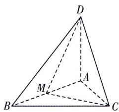

<!-- question-source:start -->
8.[北京清华附中2025高二期中]如图,在四面体ABCD中, $AD\perp$ 平面ABC,点M为AB的中点,且 $AB=AC=2,BC=2\sqrt{2},AD=2.$ (1)证明: $AC\perp BD.$ (2)求平面BCD与平面CDM夹角的余弦值.
(3)在线段BD上是否存在点P,使得直线PC
与平面CDM所成角的正弦值为 $\frac{1}{6}$ ?若存在;
求 $\frac{BP}{BD}$ 的值;若不存在,请说明理由.

<!-- question-source:end -->

![[Q00003579A1]]
