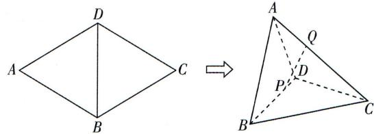

<!-- question-source:start -->
11.[陕西西安中学2024高二期中]如图,在菱形ABCD中, $AB=\frac{4\sqrt{3}}{3}$ , $\angle BAD=60^{\circ}$ ,沿对角线BD将 $\triangle ABD$ 折起,使点A,C之间的距离为 $2\sqrt{2}$ .若P,Q分别为线段BD,CA上的动点,则收拾一下心情,开始下一个新的开始。

下列说法正确的是

( )

A. 平面 $ABD \perp$ 平面 $BCD$ B. 线段 $PQ$ 长度的最小值为 $\sqrt{2}$ C. 当 $AQ = QC, 4PD = DB$ 时, 点 $D$ 到直线 $PQ$ 的距离为 $\frac{\sqrt{14}}{14}$ D. 当 $P, Q$ 分别为线段 $BD, CA$ 的中点时, $PQ$ 与 $AD$ 所成角的余弦值为 $\frac{\sqrt{6}}{4}$

## 三、填空题: 本大题共 3 小题, 每小题 5 分, 共 15 分.
<!-- question-source:end -->

![[Q00003597A1]]
