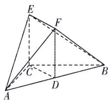

<!-- question-source:start -->
16.(本小题满分15分)[北京朝阳区2025高二期末]如图,在六面体ABCEF中,D为AB的中点,四边形CDFE为矩形,且EC⊥CB,AC⊥CB,AC=CB=4.
(1)求证:EC⊥平面ABC.
(2)再从条件①,条件②,条件③这三个条件中选择一个作为已知,求平面EAF与平面ECB夹角的余弦值.
条件①:AE=5;
条件②:△ABF的面积为 $6\sqrt{2}$ ;
条件③:六面体ABCEF的体积为16.
注:如果选择多个条件分别解答,按第一个解答计分.

<!-- question-source:end -->

![[Q00003602A1]]
