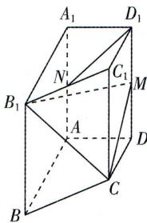

<!-- question-source:start -->
6.[天津2024·17,15分]如图,在四棱柱ABCD- $A_{1}B_{1}C_{1}D_{1}$ 中, $AA_{1} \perp$ 平面ABCD, $AB \perp AD$ , $AB // DC$ , $AB = AA_{1} = 2$ , $AD = DC = 1$ , $M$ , $N$ 分别为 $DD_{1}, B_{1}C_{1}$ 的中点. (1)求证: $D_{1}N //$ 平面 $CB_{1}M$ ; (2)求平面 $CB_{1}M$ 与平面 $BB_{1}C_{1}C$ 夹角的余弦值; (3)求点 $B$ 到平面 $CB_{1}M$ 的距离.

<!-- question-source:end -->

![[Q00003611A1]]
