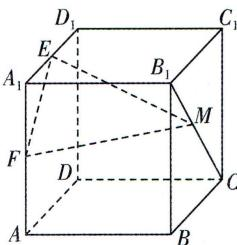

<!-- question-source:start -->
7.[河南许昌2025高二联考]如图,在正方体ABCD- $A_{1}B_{1}C_{1}D_{1}$ 中,E为 $A_{1}D_{1}$ 的中点,F为 $AA_{1}$ 的中点,M在线段 $B_{1}C$ 上,则直线 $DD_{1}$ 与平面MEF所成角的最大值为平面MEF所成角的最大值为 （ ）A. $\frac{\pi}{2}$ B. $\frac{\pi}{3}$ C. $\frac{\pi}{4}$ D. $\frac{\pi}{6}$

<!-- question-source:end -->

![[Q00003553A1]]
