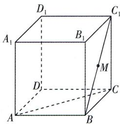

<!-- question-source:start -->
6. (多选) [辽宁抚顺六校 2024 高二联考] 如图, 正方体 $ABCD-A_{1}B_{1}C_{1}D_{1}$ 的棱长为 2, M 是 $BC_{1}$ 的中点, 点 P 满足 $\overrightarrow{DP}=\lambda\overrightarrow{DC}+\mu\overrightarrow{DD_{1}}$ , 其中

$\lambda \in [0,1], \mu \in [0,1]$ , 则下列结论正确的有
( )
A. 当 $\lambda = \frac{1}{2}$ 时, $MP \perp AC$ B. 当 $\mu = \frac{1}{2}$ 时, $MP //$ 平面 $ABCD$ C. 当 $\lambda = \mu = \frac{2}{3}$ 时, 异面直线 $MP$ 与 $AC$ 所成角的余弦值为 $\frac{\sqrt{7}}{7}$ D. 若 $\lambda = \frac{1}{2}$ , 二面角 $P - BD - C$ 的大小为 $\frac{\pi}{4}$ , 则 $\triangle PBD$ 的面积为 $\sqrt{2}$
<!-- question-source:end -->

![[Q00003567A1]]
