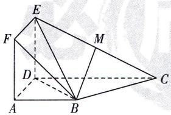

<!-- question-source:start -->
12.[安徽六安2025高二期中]如图,正方形ADEF与梯形ABCD所在的平面互相垂直, $AD\perp CD,AB\parallel CD,AB=AD=2,CD=4,M$ 为CE的中点.
(1) 求证: BM// 平面 ADEF;
(2) 求证: BC⊥ 平面 BDE.

<!-- question-source:end -->

![[Q00003526A1]]
