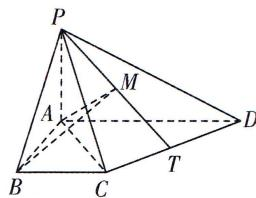

<!-- question-source:start -->
13.[江西宜春上高二中2025高二月考]如图,在四棱锥P-ABCD中, $PA\perp$ 平面ABCD,PB与底面ABCD所成角为 $45^{\circ}$ ,四边形ABCD是梯形, $AD\perp AB,BC//AD,AD=4,PA=BC=2.$ (1)证明:平面PAC⊥平面PCD.
(2)点T是线段CD上的动点,在线段PT上是否存在点M,使PT⊥平面ABM,若存在,求 $\frac{PM}{PT}$ 的值;若不存在,请说明理由.

<!-- question-source:end -->

![[Q00003527A1]]
