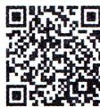
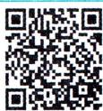

### 2.1.1 倾斜角与斜率 2.1.2 两条直线平行和垂直的判定

## 2.1.1 倾斜角与斜率 + 2.1.2 两条直线平行和垂直的判定刷基础

  
视频微课

  
错题本

√ 答案 P131

![[2026版 必刷题 数学选择性必修第一册RJA/02-第二章_直线和圆的方程/2.1.1_倾斜角与斜率_2.1.2_两条直线平行和垂直的判定/题型 1 直线的倾斜角与斜率/题型 1 直线的倾斜角与斜率_b1.md]]
![[2026版 必刷题 数学选择性必修第一册RJA/02-第二章_直线和圆的方程/2.1.1_倾斜角与斜率_2.1.2_两条直线平行和垂直的判定/题型 2 两条直线平行与垂直的判定/题型 2 两条直线平行与垂直的判定_b2.md]]
![[2026版 必刷题 数学选择性必修第一册RJA/02-第二章_直线和圆的方程/2.1.1_倾斜角与斜率_2.1.2_两条直线平行和垂直的判定/题型 3 平行与垂直的应用/题型 3 平行与垂直的应用_b3.md]]
