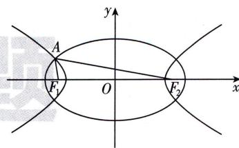

<!-- question-source:start -->
8.[重庆礼嘉中学2025高二期中]如图,椭圆 $\frac{x^{2}}{6}+$ $\frac{y^{2}}{2}=1$ 和双曲线 $\frac{x^{2}}{3}-y^{2}=1$ 的公共焦点分别为 $F_{1}, F_{2}, A$ 是椭圆与双曲线的一个交点，则 $|AF_{1}|\cdot|AF_{2}|=$ （）

A. 3 B. 4 C. 5 D. 6
<!-- question-source:end -->

![[Q00003924A1]]
