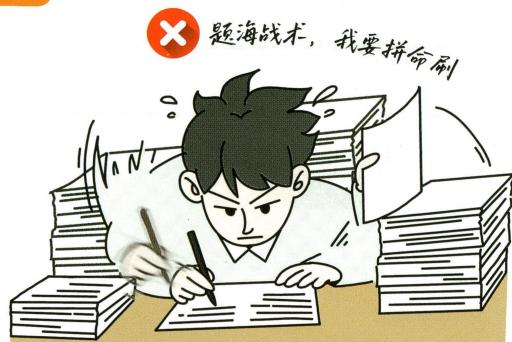
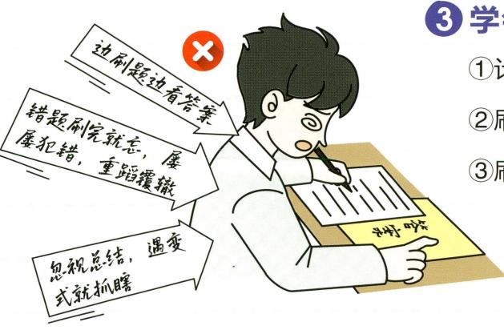
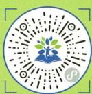
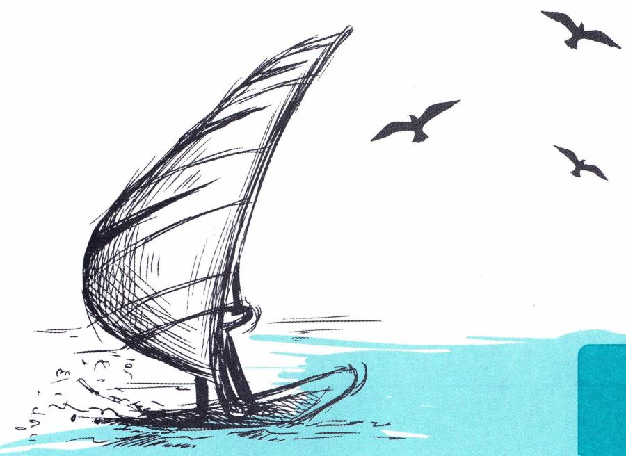
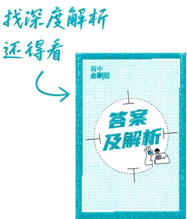

<!-- source-part:1 pages:1-53 -->

小考、中考，期中考、期末考，单元考、月考，你从各种考试中走来。

选择题、填空题、解答题；  
作用力的问题、赛跑的问题、溶液的问题；  
你认不认得这个字，你会写吗；  
他活了多少岁，他做了几件好事、几件坏事；  
函数、三角形还有一个圆，达·芬奇画画都在用的那些原理；

run还是running，加to还是for；

Oh，你天天都在刷。

## i'n afraid of you 我害怕你 刷题的人 who universe themselves in exercises

我害怕你，刷题的人。  
一道题，一打眼你就知道考的是哪个知识点；  
一看选项，你就知道错在哪里，  
你就知道那是个陷阱。  
你看透了出题人，  
他们的那些挖空心思、绞尽脑汁，  
在你面前都是一些无法遁形的小小伎俩。  
拿起试卷，你嘴角上扬，  
你可知道，那是只属于赢家的笑。

学霸题海里游出一身肌肉，学神题海里踏出一条大道。

我害怕你，刷题的人。  
你用自己活生生地界定了学神与学霸灵魂上的差别你明白刷题的意义，  
你知道刷题的好与坏。  
你懂得分类，  
你有自己的一套策略。

我害怕你，刷题的人。  
人世间的种种，  
甚至是生活的种种逻辑，  
逃不出刷题的范围。  
你去琢磨，你去钻研，  
你用刷题的逻辑解决生活中遇到的问题，  
你发现毫不违和，通行天下。

每天，你来到教室，坐下来，
被老师们各种灌，
你拉开架势，
打开那本仿佛不用放在眼里的教科书，
似乎要虽千万人吾往矣。

你明白这是一条不得不走的路。  
你明白有些东西考过即扔，  
希望老死不相往来。  
你明白，你都明白。

你不言不语，不怒不哀，不逃不躲，  
你打下整个世界，  
天朗气清，惠风和畅。

新教材课程表（仅供参考）

<table><tr><td>科目</td><td>语文</td><td>数学</td><td>英语</td><td>物理</td><td>化学</td><td>生物学</td><td>历史</td><td>政治</td><td>地理</td></tr><tr><td rowspan="2">高二上</td><td>选择性必修上册</td><td>选择性必修第一册</td><td>选择性必修第一册</td><td>选择性必修第一册</td><td>选择性必修1化学反应原理</td><td>选择性必修1稳态与调节</td><td>选择性必修1国家制度与社会治理</td><td>必修4哲学与文化</td><td>选择性必修1自然地理基础</td></tr><tr><td>选择性必修中册</td><td>选择性必修第二册</td><td>选择性必修第二册</td><td>选择性必修第二册</td><td>选择性必修2物质结构与性质</td><td>选择性必修2生物与环境</td><td>选择性必修2经济与社会生活</td><td>选择性必修1当代国际政治与经济</td><td>选择性必修2区域发展</td></tr><tr><td>高二下</td><td>选择性必修下册</td><td>选择性必修第三册</td><td>选择性必修第三册</td><td>选择性必修第三册</td><td>选择性必修3有机化学基础</td><td>选择性必修3生物技术与工程</td><td>选择性必修3文化交流与传播</td><td>选择性必修2法律与生活</td><td>选择性必修3资源、环境与国家安全</td></tr></table>

策划：盛晓萌 王筱玮

责任编辑：王晶

执行编辑：梁雪艳

封面设计： smart 巩欣晔
MOB 1357032-1009

# 高中 2026 总主编：杨文彬 主编：赵成海 必刷题

定价：54.80元

## 含新定义、开放题等

狂K重点

  
电子预习卡  
视频微课轻松看

数学

选择性必修 第一册 RJA

# 从题海出走 做有姿态的刷题家

此刻正值高中的分水岭，难度也猝不及防地升了级，只有找到属于自己的刷题节奏，选对正确的“姿态”，才能与知识进行一场深度对话，在这看似无尽的题海中找到方向。请以知识装备自己，循此题阶，跨越分水岭，以抵繁星。

## 刷题的正确姿态

## ① 只刷必刷的题

刷新题！刷好题！你们刷到的每一道题，都是“天选之题”，都来自全国名校联考，背后是名校名师的精挑细选。

## ② 紧跟科学题阶，拾阶而上，有目的地刷题

同步课堂·从课时到章节，从月考到期末，不断接触新知，构建知识体系。
深化学习·从基础到提升，从单一到综合，洞悉知识点之间的联系，攻克解题难关。
拔高思维·从经典题到新情境题，从真题到原创题，迎着考向练就题感。

③ 学会高阶刷题方法，让刷题事半功倍
①计时！把练习当实战，一鼓作气练完一课的内容。
②刷后复盘，常看常新，用好错题本。

③刷一题通一类，解析里的“方法套路”才是精华！

更多小绿书资源，扫码获取。

## 配套上分课，尽在必刷题课代表

## bilibili

## B站搜索：必刷题课代表

#必刷精讲

#备考资源

#重难考法

#教考新讯

真题分析

#答疑解惑

#大学专业

#福利派送

  
▶扫码即可投稿参与活动

## “理想树图书”小程序 图书会员专属服务平台

微信扫图书背面二维码
注册会员

\- 点击头像
- 完善资料
- 领积分

签到领积分

积分兑换周边/图书

理想树图书在线试读

AI智能提分，勇闯排行榜单

AI智能批改，专业写作助手

多学科测评，常练习常提升

错题轻松录，打印随心练

  
扫码获取本书增值

## 青藤计划 {以书载梦，以行践责——青藤计划公益项目}

理想树联合中国光华科技基金会共建公益助学行动，设立100万专项基金。每一笔善款都经由国家级4A基金会专业运作，让善意在阳光下开枝散叶。

若您身边有亟需帮助的学子，请以学校为单位与我们联系，我们与您携手并肩，为每一个理想全力以赴。

邮箱地址：67book@lxzwedu.com  
联系电话：400-688-9167

## 作文大赛 {真题作文爆改行动全网捞显眼包！}

真题作文太难了？不存在的！

  
扫码解锁更多攻略

2025年6月7日—8月10日
持续收集新高考真题作文，投稿即有机会解锁SSR级奖励！

## 活动专区

## 句有引力 {笔尖星光，页脚绽放 ——理想树页脚语征集}

把你的感悟写成便签，塞进理想树书页的缝隙

某年某月，当陌生人的指尖翻到这里——你的句子，会轻轻叩响一颗共鸣的心

优质稿件可获得精美礼品

每月7日前在理想树高中公众号公布

即日起—2025年12月31日

刷题小手 点点关注

@理想树高中

@众望教育集团

  
@理想树图书官方号

小红书

@理想树图书官方

@理想树必刷题 试题网
www.stzy.com

众望教育官网
www.lxzwedu.com

# 高中 必刷题

总主编：杨文彬

主 编：赵成海

编者：湛力 蔡文武 韩磊 王欢 鲁棣松 韩永权
张智慧 刘卫东 杜双敏 李友桥 杜金燕 刘彦永
燕洁 胡泽良 韩利侠 熊焕军 张荣华 叶晓斌
袁媛 屈锡金 闫琳 胡磊 马金玲

审订：毛开庆 王雪峰 孔祥士 郭自朝 李宗彦 毛巍
马进才

刷题人：\_\_\_\_

数学

选择性必修 第一册 RJA

图书在版编目（CIP）数据

高中必刷题. 数学: 选择性必修. 第一册: RJA / 赵成海主编. -- 北京: 首都师范大学出版社, 2020.4 (2025.3 重印)

ISBN 978-7-5656-5658-3

I. ①高… 
II. ①赵… 
III. ①中学数学课—高中—习题集 
IV. ①G634

中国版本图书馆 CIP 数据核字 (2020) 第 031938 号

GAOZHONG BISHUATI SHUXUE XUANZEXINGBIXIU DIYICE RJA

## 高中必刷题 数学 选择性必修 第一册 RJA

赵成海 主编

责任编辑 王晶

首都师范大学出版社出版发行

地址 北京西三环北路105号

邮编 100048

电话 68418523（总编室） 68982468（发行部）

网址 http://cnupn.cnu.edu.cn

印刷 三河市荣展印务有限公司

经销 全国新华书店

版 次 2020年4月第1版

印 次 2025年3月第6次印刷

开 本 $880\mathrm{mm}\times 1230\mathrm{mm}$ 1/16

印 张 18.5

字 数 319千

定价 54.80 元

版权所有 违者必究

如有质量问题 请与出版社联系退换

## CONTENTS 目录

1.1 空间向量及其运算 …… (1) (99)
1.1.1 空间向量及其线性运算 …… 刷基础 (1) (99)
1.1.2 空间向量的数量积运算 …… 刷基础 刷提升 (3) (100)
1.2 空间向量基本定理 …… 刷基础 (6) (103)
1.3 空间向量及其运算的坐标表示 …… (7) (104)
1.3.1 空间直角坐标系 1.3.2 空间向量运算的坐标
表示 …… 刷基础 (7) (104)
第1.1\~1.3节综合训练 …… 刷能力 (9) (105)
1.4 空间向量的应用 …… (11) (107)
1.4.1 用空间向量研究直线、平面的位置关系 …… (11) (107)
课时1 空间中点、直线和平面的向量表示 …… 刷基础 (11) (107)
课时2 空间线面位置关系的判定 …… 刷基础 (12) (108)
1.4.2 用空间向量研究距离、夹角问题 …… (14) (109)
课时1 用空间向量研究距离问题 …… 刷基础 刷提升 (14) (109)
课时2 用空间向量研究夹角问题 …… 刷基础 刷提升 (16) (112)
第1.4节综合训练 …… 刷能力 (20) (119)
专题1 空间中的动点问题 …… 刷难关 (22) (122)
第一章素养检测 …… 刷速度 (23) (123)
第一章高考强化 …… 刷真题 刷原创 (27) (127)

2.1 直线的倾斜角与斜率 …… (29) (131)
2.1.1 倾斜角与斜率 2.1.2 两条直线平行和垂直
的判定 …… 刷基础 (29) (131)
第2.1节综合训练 …… 刷能力 (30) (131)
2.2 直线的方程 …… (31) (132)
2.2.1 直线的点斜式方程 …… 刷基础 (31) (132)
2.2.2 直线的两点式方程 …… 刷基础 (32) (133)
2.2.3 直线的一般式方程 …… 刷基础 (33) (134)
第2.2节综合训练 …… 刷能力 (34) (134)
2.3 直线的交点坐标与距离公式 …… (35) (135)
2.3.1 两条直线的交点坐标 …… 刷基础 (35) (135)
2.3.2 两点间的距离公式 …… 刷基础 (36) (136)
2.3.3 点到直线的距离公式 2.3.4 两条平行直线间的距离 …… 刷基础 (37) (137)
第2.3节综合训练 …… 刷能力 (38) (138)
专题2 与直线有关的对称问题 …… 刷难关 (39) (140)
专题3 与直线有关的最值问题 …… 刷难关 (40) (141)
2.4 圆的方程 …… (41) (142)
2.4.1 圆的标准方程 …… 刷基础 (41) (142)

## CONTENTS 目录

2.4.2 圆的一般方程 …… 刷基础 (42)(143)
第2.4节综合训练 …… 刷能力 (43)(144)

2.5 直线与圆、圆与圆的位置关系 …… (44)(145)
2.5.1 直线与圆的位置关系 …… 刷基础 (44)(145)
2.5.2 圆与圆的位置关系 …… 刷基础 (46)(147)
第2.5节综合训练 …… 刷能力 (48)(148)

专题4 与圆有关的轨迹问题 …… 刷难关 (49)(150)
第二章素养检测 …… 刷速度 (50)(151)
第二章高考强化 …… 刷真题 刷原创 (53)(154)

3.1 椭圆 …… (54)(156)
3.1.1 椭圆及其标准方程 …… 刷基础 刷提升 (54)(156)
3.1.2 椭圆的简单几何性质 …… (56)(158)
课时1 椭圆的简单几何性质 …… 刷基础 (56)(158)
课时2 直线与椭圆的位置关系 …… 刷基础 刷提升 (58)(159)
第3.1节综合训练 …… 刷能力 (61)(163)

3.2 双曲线 …… (63)(166)
3.2.1 双曲线及其标准方程 …… 刷基础 刷提升 (63)(166)
3.2.2 双曲线的简单几何性质 …… (65)(168)
课时1 双曲线的简单几何性质 …… 刷基础 (65)(168)
课时2 直线与双曲线的位置关系 …… 刷基础 刷提升 (67)(170)
第3.2节综合训练 …… 刷能力 (70)(174)

3.3 抛物线 …… (72)(177)
3.3.1 抛物线及其标准方程 …… 刷基础 刷提升 (72)(177)
3.3.2 抛物线的简单几何性质 …… 刷基础 刷提升 (74)(179)
第3.3节综合训练 …… 刷能力 (76)(183)

专题5 求离心率的值或取值范围 …… 刷难关 (78)(185)
专题6 圆锥曲线中的中点弦、对称问题 …… 刷难关 (79)(187)
专题7 圆锥曲线中的范围、最值问题 …… 刷难关 (80)(188)
专题8 圆锥曲线中的定点、定值问题 …… 刷难关 (81)(190)
专题9 圆锥曲线中的存在、探索性问题 …… 刷难关 (82)(191)
第三章素养检测 …… 刷速度 (83)(191)
第三章高考强化 …… 刷真题 刷原创 (87)(195)

高考新题型

专练1 新定义、新情境专练 …… 刷素养 (91)(201)
专练2 开放题专练 …… 刷素养 (93)(203)
模块综合测试 …… 刷综合 (95)(206)

## 重难专题

专题① 空间中的动点问题 …… 22
专题② 与直线有关的对称问题 …… 39
题型1 点关于点对称
题型2 点关于线对称
题型3 线关于点对称
题型4 线关于线对称

专题③ 与直线有关的最值问题 …… 40
题型1 两点间距离的最值问题
题型2 与距离之和（差）有关的最值问题
题型3 与面积有关的最值问题

专题④ 与圆有关的轨迹问题 …… 49
题型1 几何法求轨迹问题
题型2 代数法求轨迹问题
题型3 相关点法求轨迹问题

专题⑤ 求离心率的值或取值范围 …… 78
题型1 求离心率的值
题型2 求离心率的取值范围

专题⑥ 圆锥曲线中的中点弦、对称问题 …… 79
题型1 中点弦问题
题型2 对称问题

专题⑦ 圆锥曲线中的范围、最值问题 …… 80
· 角度1 利用基本不等式求范围或最值
· 角度2 利用定义、几何性质求范围或最值
· 角度3 利用函数的性质求范围或最值

专题⑧ 圆锥曲线中的定点、定值问题 …… 81
· 角度1 证明直线过定点
· 角度2 证明两直线斜率之积为定值

专题⑨ 圆锥曲线中的存在、探索性问题 …… 82
· 角度1 探索满足条件的点是否存在
· 角度2 探索定点是否存在

单元高难问题1 空间中的探索性问题 P21
拓展3 与直线有关的对称问题的解决方法 P32
突破 利用直线的对称性解决距离最值问题 P33
突破1 求解与圆有关的轨迹方程问题的方法 P37
拓展4 求椭圆离心率的方法 P54
拓展3 求双曲线离心率的方法 P63
突破1 椭圆的中点弦问题 P57
突破 双曲线的中点弦问题 P66
难点1 对称问题 P75
突破2 利用圆锥曲线的定义或性质求最值 P58
难点2 最值(取值范围)问题 P75
难点3 定点与定值问题 P77
难点4 探索性问题 P78

## 重难就要刷又刷

## 狂K速览

## 高考新动向·新定义、新情境

圆柱形水管上蚂蚁爬行路径问题 …… P8 第 11 题
类比直线的点法式方程求平面的方程 … P11 第 7 题
堑堵中两条直线的位置关系 …… P12 第 9 题
“表截面”定义的理解与空间角的计算 … P18 第 3 题
古代建筑攒尖结构的理解 …… P18 第 7 题
欧拉线概念的理解与应用 …… P34 第 4 题
台球中的无旋转反弹球与直线对称的结合 … P39 第 5 题
“将军饮马”问题中的最短路程问题 …… P40 第 5 题

阿波罗尼斯圆的理解与应用 …… P43 第 6 题
“逼近法”得椭圆面积的理解与应用 … P59 第 1 题
“最远距离直线”与解析几何的结合 … P59 第 8 题
根据“埙”的结构求半椭圆的方程 …… P61 第 2 题
“两全其美线”定义的理解与判定 …… P68 第 5 题
双曲线型冷却塔结构的理解 …… P70 第 5 题
卫星接收天线与抛物线的结合 …… P76 第 4 题
卫星轨道与椭圆几何性质的结合 …… P91 第 5 题

## 高考新动向·链接高数

向量外积的理解与应用 …… P5 第 5 题
“仿射”坐标系的理解与应用 …… P9 第 9 题
向量新定义运算及其几何意义 …… P10 第 13 题
“阿基米德多面体”结构特征的理解 …… P24 第 10 题
根据“有向距离”判断两条直线的位置关系
…… P38 第 8 题

利用笛卡尔定理求圆的标准方程 …… P51 第 14 题
椭圆极线定义的理解与离心率相关的最值
问题 …… P80 第 2 题
双纽线定义的理解及其性质的分析 …… P84 第 11 题
四棱锥顶点处曲率的求解 …… P91 第 2 题
利用“康威圆定理”求康威圆的半径 … P91 第 3 题

## 强基计划

【清华大学2024强基计划】正四面体中求向量数量积的最值 …… P5第8题  
【2024THUSSAT中学生标准学术能力诊断性测试】四棱锥中位置关系的证明、根据线面角求长度比值 … P22第5题  
【清华大学2024强基计划】点与直线、直线与直线位置关系的综合 …… P38第10题  
【2024THUSSAT中学生标准学术能力诊断性测试】与圆有关的轨迹问题 …… P43第9题  
【北京大学2023强基计划】与圆有关的距离的最值 …… P43第10题  
【中国科学技术大学2023强基计划】距离公式的几何意义与直线、圆位置关系的综合 …… P48第9题  
【浙江大学2023强基计划】椭圆焦点弦性质的应用 …… P62第10题  
【2023全国中学生数学奥林匹克竞赛（预赛）】圆与椭圆位置关系的综合 …… P62第11题  
【2023高中数学联赛吉林预赛】直线与椭圆位置关系的综合、证明与长度有关的式子为定值 …… P62第12题  
【2023全国高中数学联赛重庆预赛】双曲线焦点三角形的性质 …… P71第12题  
【清华大学2024强基计划】求双曲线的离心率 …… P71第13题  
【清华大学2024强基计划】直线与抛物线的位置关系的综合应用 …… P77第13题

## 找深度解析

## 易错警示

27个『易错警示』，将小细节一网打尽，快收下这份 $360^{\circ}$ 避坑指南！  
·多种解法  
32个『多种解法』，拒绝僵化，灵活领先，多种思路，多种可能。  
·链接教材  
回归教材，13个『链接教材』，助你夯实基础，以不变应万变！  
·思路导引  
不再纠结于繁杂过程，24个『思路导引』直击破题点和隐含条件，助你一路绿灯。  
·规律方法  
天才解题可不是靠乱猜的！24个『规律方法』帮你找规律，有捷径才能事半功倍。  
·名师点拨  
老师点一点，玄机自然显。15个『名师点拨』，老师的独家秘笈都属于你！

![[2026版 必刷题 数学选择性必修第一册RJA/01-第一章_空间向量与立体几何/第一章_空间向量与立体几何.md]]
![[2026版 必刷题 数学选择性必修第一册RJA/02-第二章_直线和圆的方程/第二章_直线和圆的方程.md]]
![[2026版 必刷题 数学选择性必修第一册RJA/03-第三章_圆锥曲线的方程/第三章_圆锥曲线的方程.md]]
![[2026版 必刷题 数学选择性必修第一册RJA/04-高考新题型/高考新题型.md]]
