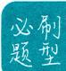

## 刷提升

▶函数的定义域 2、3、9(狂 K-P35 拓展 3)

▶函数的值或值域 4、5、6、7、8、10(狂 K-P36 拓展 4)

![[2026版 高中必刷题数学必修第一册/03-第三章_函数的概念与性质/3.1.1_函数的概念/刷提升/questions/Q00000320.md]]
![[2026版 高中必刷题数学必修第一册/03-第三章_函数的概念与性质/3.1.1_函数的概念/刷提升/questions/Q00000321.md]]
![[2026版 高中必刷题数学必修第一册/03-第三章_函数的概念与性质/3.1.1_函数的概念/刷提升/questions/Q00000322.md]]
![[2026版 高中必刷题数学必修第一册/03-第三章_函数的概念与性质/3.1.1_函数的概念/刷提升/questions/Q00000323.md]]
![[2026版 高中必刷题数学必修第一册/03-第三章_函数的概念与性质/3.1.1_函数的概念/刷提升/questions/Q00000324.md]]
![[2026版 高中必刷题数学必修第一册/03-第三章_函数的概念与性质/3.1.1_函数的概念/刷提升/questions/Q00000325.md]]
![[2026版 高中必刷题数学必修第一册/03-第三章_函数的概念与性质/3.1.1_函数的概念/刷提升/questions/Q00000326.md]]
![[2026版 高中必刷题数学必修第一册/03-第三章_函数的概念与性质/3.1.1_函数的概念/刷提升/questions/Q00000327.md]]
![[2026版 高中必刷题数学必修第一册/03-第三章_函数的概念与性质/3.1.1_函数的概念/刷提升/questions/Q00000328.md]]
![[2026版 高中必刷题数学必修第一册/03-第三章_函数的概念与性质/3.1.1_函数的概念/刷提升/questions/Q00000329.md]]
