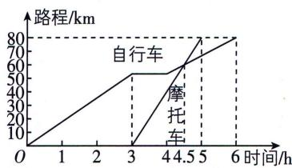

<!-- question-source:start -->
4. 如图, 表示一位骑自行车和一位骑摩托车的旅行者在相距 80 km 的甲、乙两城间从甲城到乙城所行驶的路程与时间之间的函数关系的图象, 有人根据函数图象, 提出了关于这两个旅行者的如下信息:

①骑自行车者比骑摩托车者早出发3 h, 晚到1 h;
②骑自行车者是变速运动, 骑摩托车者是匀速运动;
③骑摩托车者在出发1.5 h后追上了骑自行车者;
④骑摩托车者在出发1.5 h后与骑自行车者速度一样.
其中, 正确信息的序号是 \_\_\_\_.
<!-- question-source:end -->

![[Q00000495A1]]
