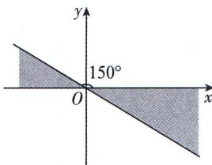

<!-- question-source:start -->
6.[河南省实验中学2025高一段考]如图,终边落在阴影部分(包括边界)的角 $\alpha$ 的集合是()

√ 答案 P225

A. $\{\alpha | 150^{\circ} + k \cdot 360^{\circ} \leqslant \alpha \leqslant 180^{\circ} + k \cdot 360^{\circ}, k \in \mathbf{Z}\}$ B. $\{\alpha | 150^{\circ} + k \cdot 180^{\circ} \leqslant \alpha \leqslant 180^{\circ} + k \cdot 180^{\circ}, k \in \mathbf{Z}\}$ C. $\{\alpha | -210^{\circ} + k \cdot 360^{\circ} \leqslant \alpha \leqslant -180^{\circ} + k \cdot 360^{\circ}, k \in \mathbf{Z}\}$ D. $\{\alpha | -30^{\circ} + k \cdot 360^{\circ} \leqslant \alpha \leqslant k \cdot 360^{\circ}, k \in \mathbf{Z}\}$
<!-- question-source:end -->

![[Q00000817A1]]
