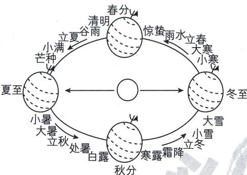

<!-- question-source:start -->
2. 现行的二十四节气是根据地球在黄道(即地球绕太阳公转的轨道)上的位置变化而制定的,每个节气对应地球在黄道上运动 $15^{\circ}$ 所到达的一个位置. 根据描述,从立冬到立春对应地球在黄道上运动所对圆心角的弧度数为 ( )

A. $-\frac{\pi}{3}$ B. $\frac{\pi}{3}$ C. $\frac{5\pi}{12}$ D. $\frac{\pi}{2}$
<!-- question-source:end -->

![[Q00000822A1]]
