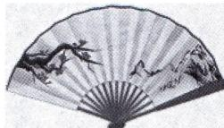

<!-- question-source:start -->
4.[湖南长沙长郡中学2025适应性考试]我国的扇文化有着深厚的文化底蕴,是民族文化的一个组成部分,历来我国有“制扇王国”之称.现有某工艺厂生产的一款优美的扇环形扇子,如图所示,其扇环面是由画有精美图案的油布构成,扇子对应的扇环外环的弧长为48cm,内环

的弧长为 16 cm, 油布径长 (外环半径与内环半径之差) 为 24 cm, 则该扇子的

油布面积大约为(油布与扇子骨架折皱部分忽略不计) ( )
A. $1024 \, cm^{2}$ B. $768 \, cm^{2}$ C. $640 \, cm^{2}$ D. $512 \, cm^{2}$

建议用时:30 分钟 答案 P227
<!-- question-source:end -->

![[Q00000842A1]]
