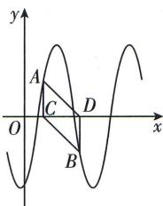

<!-- question-source:start -->
7. (多选) [福建福州一中 2025 高一段考] 已知函数 $f(x) = 4\sin (\omega x + \varphi) \left( \omega > 0, |\varphi| < \frac{\pi}{2} \right)$ 的图象如图所示, 点 $A\left(\frac{\pi}{6}, 2\right)$ , $B$ 在 $f(x)$ 的图象上 (A, B 位置如图所示), 过 $A, B$ 分别作 $x$ 轴的垂线, 垂足分别为 $C, D$ , 若四边形 ACBD 为平行四边形, 且面积为 $\frac{2\pi}{3}$ , 则下列结论正确的有 ( )

A. $T = \pi$ B. $f(x) = 4\sin \left(3x - \frac{\pi}{3}\right)$ C. $f(x)$ 在区间 $\left[-\frac{\pi}{18},\frac{5\pi}{18}\right]$ 上单调递增
D. $f(x)$ 的图象关于直线 $x = \frac{4\pi}{9}$ 对

<!-- question-source:end -->

![[Q00001115A1]]
