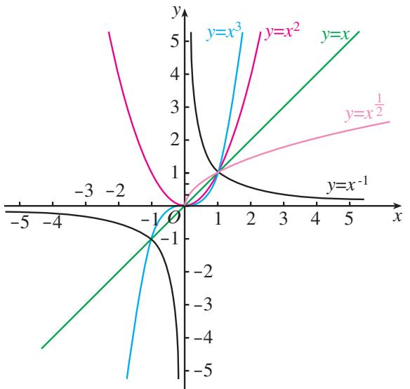

## 3.3 幂函数

前面学习了函数的概念，利用函数概念和对图象的观察，研究了函数的一些性质。本节我们利用这些知识研究一类新的函数。先看几个实例。  
（1）如果张红以 1 元/kg 的价格购买了某种蔬菜 w kg，那么她需要支付 p=w 元，这里 p 是 w 的函数；  
（2）如果正方形的边长为 a，那么正方形的面积 $S=a^{2}$ ，这里 S 是 a 的函数；  
（3）如果立方体的棱长为 b，那么立方体的体积 $V=b^{3}$ ，这里 V 是 b 的函数；  
（4）如果一个正方形场地的面积为 S，那么这个正方形的边长 $c=\sqrt{S}$ ，这里 c 是 S 的函数；  
（5）如果某人 $t$ s 内骑车行进了 $1\mathrm{km}$ ，那么他骑车的平均速度 $v = \frac{1}{t}\mathrm{km / s}$ ，即 $v = t^{-1}$ ，这里 $v$ 是 $t$ 的函数.

> [!question] 观察（1）～（5）中的函数解析式，它们有什么共同特征？
> 
>> [!success]- 答
>> 实际上，这些函数的解析式都具有幂的形式，而且都是以幂的底数为自变量；幂的指数都是常数，分别是1，2，3， $\frac{1}{2}$ ，-1；它们都是形如 $y=x^{\alpha}$ 的函数.

一般地，函数 $y=x^{\alpha}$ 叫做[幂函数](课本/【人教版】高中必修%20第一册数学电子课本/概念/幂函数.md)（power function），其中 x 是自变量， $\alpha$ 是常数.

>[!quote] 幂的指数除了可以取整数之外，还可以取其他实数，当它们取其他实数时幂也具有各自的含义，这些会在后面学习.

对于幂函数，我们只研究 $\alpha=1,2,3,\frac{1}{2},-1$ 时的图象与性质.

> [!question] 思考
结合以往学习函数的经验，你认为应该如何研究这些函数？

通常可以先根据函数解析式求出函数的定义域，画出函数的图象；再利用图象和解析式，讨论函数的值域、单调性、奇偶性等问题.

在同一坐标系中画出函数 $y = x$ ， $y = x^2$ ， $y = x^3$ ， $y = x^{\frac{1}{2}}$ 和 $y = x^{-1}$ 的图象（图3.3-1）.

图3.3-1

> [!question] 探究
> 观察函数图象并结合函数解析式，将你发现的结论写在表 3.3-1 内．
> 
> 

>   <strong>表 3.3-1</strong>
> 

> 
> | 项目 | $y = x$ | $y = x^{2}$ | $y = x^{3}$ | $y = x^{\frac{1}{2}}$ | $y = x^{-1}$ |
> | :---: | :---: | :---: | :---: | :---: | :---: |
> | **定义域** | | | | | |
> | **值域** | | | | | |
> | **奇偶性** | | | | | |
> | **单调性** | | | | | |
> 
> 这些函数图象有公共点吗？
> 
> > [!success]- **分析：**
> > 结合幂函数的图象与性质，我们可以将表 3.3-1 填写完整：
> > 
> > | 项目 | $y = x$ | $y = x^{2}$ | $y = x^{3}$ | $y = x^{\frac{1}{2}}$ | $y = x^{-1}$ |
> > | :---: | :---: | :---: | :---: | :---: | :---: |
> > | **定义域** | $\mathbb{R}$ | $\mathbb{R}$ | $\mathbb{R}$ | $[0, +\infty)$ | $(-\infty, 0) \cup (0, +\infty)$ |
> > | **值域** | $\mathbb{R}$ | $[0, +\infty)$ | $\mathbb{R}$ | $[0, +\infty)$ | $(-\infty, 0) \cup (0, +\infty)$ |
> > | **奇偶性** | 奇函数 | 偶函数 | 奇函数 | 非奇非偶 | 奇函数 |
> > | **单调性** | 在 $\mathbb{R}$ 上单调递增 | 在 $(-\infty, 0]$ 上单调递减， 在 $[0, +\infty)$ 上单调递增 | 在 $\mathbb{R}$ 上单调递增 | 在 $[0, +\infty)$ 上单调递增 | 在 $(-\infty, 0)$ 和 $(0, +\infty)$ 内分别单调递减 |
> > 
> > **关于公共点的结论：**  
> > 有公共点．从图象和解析式中可以看出，当 $x = 1$ 时，$y$ 的值均为 $1$，因此这些函数的图象都通过公共点 $(1, 1)$．

通过图 3.3-1 与表 3.3-1，我们得到：  
（1） 函数 $y = x$ , $y = x^2$ , $y = x^3$ , $y = x^{\frac{1}{2}}$ 和 $y = x^{-1}$ 的图象都通过点 (1, 1);  
（2） 函数 $y = x$ ， $y = x^3$ ， $y = x^{-1}$ 是奇函数，函数 $y = x^2$ 是偶函数；  
（3）在区间 $(0, +\infty)$ 上，函数 $y = x$ ， $y = x^{2}$ ， $y = x^{3}$ ， $y = x^{\frac{1}{2}}$ 单调递增，函数 $y = x^{-1}$ 单调递减；  
（4）在第一象限内，函数 $y=x^{-1}$ 的图象向上与 y 轴无限接近，向右与 x 轴无限接近.

> [!example]- 例 证明幂函数 $f(x)=\sqrt{x}$ 是增函数.
>
> > [!success]- 证明：
> > 函数的定义域是 $[0, +\infty)$ .
> > $\forall x_{1}, x_{2}\in[0,+\infty)$ ，且 $x_{1}<x_{2}$ ，有
> > $\begin{array}{l} f (x _ {1}) - f (x _ {2}) = \sqrt {x _ {1}} - \sqrt {x _ {2}} \\ = \frac {(\sqrt {x _ {1}} - \sqrt {x _ {2}}) (\sqrt {x _ {1}} + \sqrt {x _ {2}})}{\sqrt {x _ {1}} + \sqrt {x _ {2}}} \\ = \frac {x _ {1} - x _ {2}}{\sqrt {x _ {1}} + \sqrt {x _ {2}}}. \\ \end{array}$
> > 因为 $x_{1} - x_{2} < 0, \sqrt{x_{1}} + \sqrt{x_{2}} > 0,$
> > 所以 $f(x_{1})<f(x_{2})$ ，即幂函数 $f(x)=\sqrt{x}$ 是增函数.

#### 练习

1. 已知幂函数 $y = f(x)$ 的图象过点（2， $\sqrt{2}$ ），求这个函数的解析式.  
2. 利用幂函数的性质，比较下列各题中两个值的大小：  
（1） $(-1.5)^{3}$ , $(-1.4)^{3}$ ;  
（2） $\frac{1}{-1.5}, \frac{1}{-1.4}$ .

3. 根据单调性和奇偶性的定义，讨论函数 $f(x) = x^3$ 的单调性，并判断其奇偶性.

---

[习题3.3 幂函数](课本/【人教版】高中必修%20第一册数学电子课本/习题/习题3.3%20幂函数.md)

 [探究与发现 探究函数 y = x +1➗x 的图象与性质](课本/【人教版】高中必修%20第一册数学电子课本/知识点/探究与发现%20探究函数%20y%20=%20x%20+1➗x%20的图象与性质.md)
