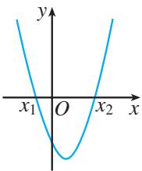
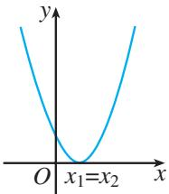
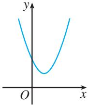

在初中，我们从一次函数的角度看一元一次方程、一元一次不等式，发现了三者之间的内在联系，利用这种联系可以更好地解决相关问题。对于二次函数、一元二次方程和一元二次不等式，是否也有这样的联系呢？先来看一个问题。

> [!info] **情景引入**
> **问题** 园艺师打算在绿地上用栅栏围一个矩形区域种植花卉．若栅栏的长度是 $24 \text{ m}$，围成的矩形区域的面积要大于 $20 \text{ m}^{2}$，则这个矩形的边长为多少米？
> 
> > [!success] **答：**
> > 设这个矩形的一条边长为 $x \text{ m}$，则另一条边长为 $(12 - x) \text{ m}$．由题意，得
> > 
> > 

> >   
> > 

> > 
> > $$(12 - x)x > 20,$$
> > 其中 $x \in \{x \mid 0 < x < 12\}$．整理得
> > $$x^{2} - 12x + 20 < 0, \quad x \in \{x \mid 0 < x < 12\} \tag{①}$$
> > 求得不等式①的解集，就得到了问题的答案．

一般地，我们把只含有一个未知数，并且未知数的最高次数是 2 的不等式，称为[一元二次不等式](课本/【人教版】高中必修%20第一册数学电子课本/概念/一元二次不等式.md)（quadratic inequality with one unknown）．一元二次不等式的一般形式是
$$ax^{2} + bx + c > 0 \quad \text{或} \quad ax^{2} + bx + c < 0,$$
其中 $a, b, c$ 均为常数，$a \neq 0$．

> [!question] 思考
> 在初中，我们学习了从一次函数的观点看一元一次方程、一元一次不等式的思想方法．类似地，能否从二次函数的观点看一元二次不等式，进而得到一元二次不等式的求解方法呢？

下面，我们先考察一元二次不等式 $x^{2} - 12x + 20 < 0$ 与二次函数 $y = x^{2} - 12x + 20$ 之间的关系．

如图 2.3-1，在平面直角坐标系中画出二次函数 $y=x^{2}-12x+20$ 的图象，图象与 x 轴有两个交点。这两个交点的横坐标就是方程 $x^{2}-12x+20=0$ 的两个实数根 $x_{1}=2$ ， $x_{2}=10$ ，因此二次函数 $y=x^{2}-12x+20$ 的图象与 x 轴的两个交点是 $(2,0)$ 和 $(10,0)$ 。

一般地，对于二次函数 $y=ax^{2}+bx+c$ ，我们把使 $ax^{2}+bx+c=0$ 的实数 x 叫做二次函数 $y=ax^{2}+bx+c$ 的[零点](课本/【人教版】高中必修%20第一册数学电子课本/概念/零点.md)。于是，二次函数 $y=x^{2}-12x+20$ 的两个零点是 $x_{1}=2,\quad x_{2}=10$ 。

从图2.3-1可以看出，二次函数 $y = x^{2} - 12x + 20$ 的两个零点 $x_{1} = 2$ ， $x_{2} = 10$ 将 $x$ 轴分成三段。相应地，当 $x < 2$ 或 $x > 10$ 时，函数图象位于 $x$ 轴上方，此时 $y > 0$ ，即 $x^{2} - 12x + 20 > 0$ ；当 $2 < x < 10$ 时，函数图象位于 $x$ 轴下方，此时 $y < 0$ ，即 $x^{2} - 12x + 20 < 0$ 。所以，一元二次不等式 $x^{2} - 12x + 20 < 0$ 的解集是

  
   
  图2.3-1

$$\{x \mid 2 <   x <   1 0 \}.$$
因为 $\{x\mid 2 <   x <   10\} \subseteq \{x\mid 0 <   x <   12\}$ ，因此当围成的矩形的一条边长 $x$ 满足 $2 <   x <   10$ 时，围成的矩形区域的面积大于 $20~\mathrm{m}^2$

上述方法可以推广到求一般的一元二次不等式 $ax^2 + bx + c > 0 (a > 0)$ 和 $ax^2 + bx + c < 0 (a > 0)$ 的解集。因为一元二次方程的根是相应一元二次函数的零点，所以先求出一元二次方程的根，再根据二次函数图象与 $x$ 轴的相关位置确定一元二次不等式的解集。

我们知道，对于一元二次方程 $ax^2 + bx + c = 0 (a > 0)$ ，设 $\Delta = b^2 - 4ac$ ，它的根按照 $\Delta > 0$ ， $\Delta = 0$ ， $\Delta < 0$ 可分为三种情况。相应地，二次函数 $y = ax^2 + bx + c (a > 0)$ 的图象与 $x$ 轴的位置关系也分为三种情况。因此，我们分三种情况来讨论对应的一元二次不等式 $ax^2 + bx + c > 0 (a > 0)$ 和 $ax^2 + bx + c < 0 (a > 0)$ 的解集（表2.3-1）。

表 2.3-1 二次函数与一元二次方程、不等式的解的对应关系

| 项目                                | $\Delta > 0$                                                                             | $\Delta = 0$                                                                             | $\Delta < 0$                                                                             |
| :-------------------------------- | :--------------------------------------------------------------------------------------- | :--------------------------------------------------------------------------------------- | :--------------------------------------------------------------------------------------- |
| **$y=ax^2+bx+c \; (a>0)$ 的图象** |  |  |  |
| **$ax^2+bx+c=0 \; (a>0)$ 的根**  | 有两个不相等的实数根 $x_1, x_2 \; (x_1 < x_2)$                                                  | 有两个相等的实数根 $x_1 = x_2 = -\frac{b}{2a}$                                                 | 没有实数根                                                                                    |
| **$ax^2+bx+c>0 \; (a>0)$ 的解集** | $\{x \mid x < x_1 \text{ 或 } x > x_2\}$                                                  | $\{x \mid x \neq -\frac{b}{2a}\}$                                                        | $\mathbb{R}$                                                                             |
| **$ax^2+bx+c<0 \; (a>0)$ 的解集** | $\{x \mid x_1 < x < x_2\}$                                                               | $\emptyset$                                                                              | $\emptyset$                                                                              |

> [!example]- 例 1 求不等式 $x^{2}-5x+6>0$ 的解集.
>
> > [!tip]- 分析：
> > 因为方程 $x^{2}-5x+6=0$ 的根是函数 $y=x^{2}-5x+6$ 的零点，所以先求出 $x^{2}-5x+6=0$ 的根，再根据函数图象得到 $x^{2}-5x+6>0$ 的解集.
>
> > [!success]- 解：
> > 对于方程 $x^{2} - 5x + 6 = 0$ ，因为 $\Delta >0$ ，所以它有两个实数根．解得 $x_{1} = 2$ ， $x_{2} = 3$
> >
> > 画出二次函数 $y=x^{2}-5x+6$ 的图象（图 2.3-2），结合图象得不等式 $x^{2}-5x+6>0$ 的解集为 $\{x|x<2,$ 或 $x>3\}$ .
> >
> > 

> >   
> >    
> >   图2.3-2
> > 

> [!example]- 例 2 求不等式 $9x^{2}-6x+1>0$ 的解集.
>
> > [!success]- 解：
> > 对于方程 $9x^{2} - 6x + 1 = 0$ ，因为 $\Delta = 0$ ，所以它有两个相等的实数根，解得 $x_{1} = x_{2} = \frac{1}{3}$
> >
> > 画出二次函数 $y = 9x^{2} - 6x + 1$ 的图象（图2.3-3），结合图象得不等式 $9x^{2} - 6x + 1 > 0$ 的解集为 $\{x \mid x \neq \frac{1}{3}\}$ .
> >
> > 

> >   
> >    
> >   图2.3-3
> > 

> [!example]- 例 3 求不等式 $-x^{2}+2x-3>0$ 的解集.
>
> > [!success]- 解：
> > 不等式可化为 $x^{2} - 2x + 3 < 0$
> > 因为 $\Delta = -8 < 0$ ，所以方程 $x^{2} - 2x + 3 = 0$ 无实数根.
> >
> > 画出二次函数 $y=x^{2}-2x+3$ 的图象（图 2.3-4）.
> >
> > 

> >   
> >    
> >   图2.3-4
> > 

> >
> > 对于二次项系数是负数（即 $a < 0$ ）的不等式，可以先把二次项系数化成正数，再求解.
> >
> > 结合图象得不等式 $x^{2}-2x+3<0$ 的解集为 $\varnothing$ .
> > 因此，原不等式的解集为∅.

现在，你能解决第2.1节的“问题2”了吗？

利用框图可以清晰地表示求解一元二次不等式的过程. 这里, 我们以求解可化成 $ax^2 + bx + c > 0 (a > 0)$ 形式的不等式为例, 用框图表示其求解过程 (图 2.3-5).

   
    
   图2.3-5
 

#### 练习

1. 求下列不等式的解集：  
（1） $(x + 2)(x - 3) > 0$ ;  
（2） $3x^{2} - 7x \leqslant 10$ ;  
（3） $-x^{2} + 4x - 4 < 0$ ;  
（4） $x^{2} - x + \frac{1}{4} < 0;$  
（5） $-2x^{2} + x \leqslant -3$ ;  
（6） $x^{2} - 3x + 4 > 0.$

2. 当自变量 x 在什么范围取值时，下列函数的值等于 0？大于 0？小于 0？  
（1） $y = 3x^{2} - 6x + 2;$  
（2） $y = 25 - x^{2}$ ;  
（3） $y = x^{2} + 6x + 10;$  
（4） $y = -3x^{2} + 12x - 12.$