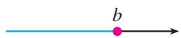

研究函数时常会用到区间的概念.

设 $a, b$ 是两个实数，而且 $a < b$ 。我们规定：  
（1）满足不等式 $a \leqslant x \leqslant b$ 的实数 x 的集合叫做[闭区间](课本/【人教版】高中必修%20第一册数学电子课本/概念/闭区间.md)，表示为 $[a, b]$ ;  
（2） 满足不等式 a < x < b 的实数 x 的集合叫做[开区间](课本/【人教版】高中必修%20第一册数学电子课本/概念/开区间.md)，表示为 $(a, b)$ ;  
（3）满足不等式 $a \leqslant x < b$ 或 $a < x \leqslant b$ 的实数 $x$ 的集合叫做[半开半闭区间](课本/【人教版】高中必修%20第一册数学电子课本/概念/半开半闭区间.md)，分别表示为 $[a, b), (a, b]$ .

这里的实数 a 与 b 都叫做相应区间的[端点](课本/【人教版】高中必修%20第一册数学电子课本/概念/端点.md).

这些区间的几何表示如表 3.1-2 所示。在数轴表示时，用实心点表示包括在区间内的端点，用空心点表示不包括在区间内的端点。

表3.1-2

|    区间    | 数轴表示                                                                         |
| :------: | :--------------------------------------------------------------------------- |
| $[a, b]$ |  |
| $(a, b)$ |  |
| $[a, b)$ |  |
| $(a, b]$ |  |

实数集 R 可以用区间表示为 $(-∞, +∞)$ ，“∞”读作“无穷大”，“-∞”读作“负

无穷大”，“+∞”读作“正无穷大”.

满足 $x \geqslant a, x > a, x \leqslant b, x < b$ 的实数 $x$ 的集合，可以用区间分别表示为 $[a, +\infty), (a, +\infty), (-\infty, b], (-\infty, b)$ . 这些区间的几何表示如表3.1-3所示.

表3.1-3

<table><tr><td>区间</td><td>数轴表示</td></tr><tr><td>[a,+∞)</td><td></td></tr><tr><td>(a,+∞)</td><td></td></tr><tr><td>(-∞,b]</td><td></td></tr><tr><td>(-∞,b)</td><td></td></tr></table>

>[!tip] 在函数定义中，我们用符号 $y = f(x)$ 表示函数，其中 $f(x)$ 表示 $x$ 对应的函数值，而不是 $f$ 乘 $x$ .

> [!example]- 例 2 已知函数 $f(x)=\sqrt{x+3}+\frac{1}{x+2}$ ,
> （1） 求函数的定义域;
> （2） 求 $f(-3)$ ， $f\left(\frac{2}{3}\right)$ 的值；
> （3） 当 a > 0 时，求 $f(a)$ ， $f(a - 1)$ 的值.
>
> > [!tip]- 分析：
> > 函数的定义域通常由问题的实际背景确定。如果只给出解析式 $y = f(x)$ ，而没有指明它的定义域，那么函数的定义域就是指能使这个式子有意义的实数的集合。
> >

>
> > [!success]- 解：
> > （1）使根式 $\sqrt{x + 3}$ 有意义的实数 $x$ 的集合是 $\{x \mid x \geqslant -3\}$ ，使分式 $\frac{1}{x + 2}$ 有意义的实数 $x$ 的集合是 $\{x \mid x \neq -2\}$ . 所以，这个函数的定义域是
> > $\{x \mid x \geqslant - 3 \} \cap \{x \mid x \neq - 2 \} = \{x \mid x \geqslant - 3, \text {且} x \neq - 2 \},$
> > 即 $\left[-3,-2\right)\cup(-2,+\infty)$ .
> > （2） 将 -3 与 $\frac{2}{3}$ 代入解析式，有
> > $f (- 3) = \sqrt {- 3 + 3} + \frac {1}{- 3 + 2} = - 1;$
> > $f \left(\frac {2}{3}\right) = \sqrt {\frac {2}{3} + 3} + \frac {1}{\frac {2}{3} + 2} = \sqrt {\frac {1 1}{3}} + \frac {3}{8} = \frac {3}{8} + \frac {\sqrt {3 3}}{3}.$
> > （3）因为 a > 0，所以 $f(a)$ ， $f(a - 1)$ 有意义.
> > $f (a) = \sqrt {a + 3} + \frac {1}{a + 2};$
> > $f (a - 1) = \sqrt {a - 1 + 3} + \frac {1}{a - 1 + 2} = \sqrt {a + 2} + \frac {1}{a + 1}.$

 由函数的定义可知，一个函数的构成要素为：定义域、对应关系和值域。因为值域是由定义域和对应关系决定的，所以，如果两个函数的定义域相同，并且对应关系完全一致，即相同的自变量对应的函数值也相同，那么这两个函数是同一个函数。

两个函数如果仅有对应关系相同，但定义域不相同，那么它们不是同一个函数。例如，前面的问题1和问题2中，尽管两个函数的对应关系都是 $y = 350x$ ，但它们的定义域不相同，因此它们不是同一个函数；同时，它们的定义域都不是R，而是R的真子集，因此它们与正比例函数 $y = 350x (x \in \mathbf{R})$ 也不是同一个函数。

此外，函数 $u = t^2$ ， $t\in (-\infty , + \infty)$ ， $x = y^{2}$ ， $y\in (-\infty , + \infty)$ 与 $y = x^{2}$ $x\in (-\infty , + \infty)$ ，虽然表示它们的字母不同，但因为它们的对应关系和定义域相同，所以它们是同一个函数.

> [!example]- 例 3 下列函数中哪个与函数 y=x 是同一个函数?
> （1） $y = (\sqrt{x})^2$ ;
> （2） $u=\sqrt[3]{v^{3}}$ ;
> （3） $y = \sqrt{x^2}$ ;
> （4） $m = \frac{n^2}{n}$ .
>
> > [!success]- 解：
> > （1） $y=(\sqrt{x})^{2}=x(x\in\{x|x\geqslant0\})$ ，它与函数 $y=x(x\in\mathbf{R})$ 虽然对应关系相同，但是定义域不相同，所以这个函数与函数 $y=x(x\in\mathbf{R})$ 不是同一个函数.
> > （2） $u = \sqrt[3]{v^3} = v(v \in \mathbf{R})$ ，它与函数 $y = x (x \in \mathbf{R})$ 不仅对应关系相同，而且定义域也相同，所以这个函数与函数 $y = x (x \in \mathbf{R})$ 是同一个函数.
> > （3） $y = \sqrt{x^2} = |x| = \begin{cases} -x, & x < 0, \\ x, & x \geqslant 0, \end{cases}$ 它与函数 $y = x (x \in \mathbf{R})$ 的定义域都是实数集 $\mathbf{R}$ ，但是当 $x < 0$ 时，它的对应关系与函数 $y = x (x \in \mathbf{R})$ 不相同。所以这个函数与函数 $y = x (x \in \mathbf{R})$ 不是同一个函数。
> > （4） $m = \frac{n^2}{n} = n (n \in \{n \mid n \neq 0\})$ ，它与函数 $y = x (x \in \mathbf{R})$ 的对应关系相同但定义域不相同。所以这个函数与函数 $y = x (x \in \mathbf{R})$ 不是同一个函数。
> 
> >[!quote] 也可以利用信息技术画出例3中四个函数的图象，根据图象进行判断.

> [!question] 思考
至此，我们在初中学习的基础上，运用集合语言和对应关系刻画了函数，并引进了符号 $y = f(x)$ ，明确了函数的构成要素。比较函数的这两种定义，你对函数有什么新的认识？

#### 练习

1. 求下列函数的定义域：  
（1） $f(x)=\frac{1}{4x+7};$  
（2） $f(x) = \sqrt{1 - x} + \sqrt{x + 3} - 1.$

2. 已知函数 $f(x)=3x^{3}+2x$ ,  
（1） 求 $f(2)$ ， $f(-2)$ ， $f(2)+f(-2)$ 的值；  
（2） 求 $f(a)$ ， $f(-a)$ ， $f(a)+f(-a)$ 的值.

3. 判断下列各组中的函数是否为同一个函数，并说明理由：  
（1）表示炮弹飞行高度 $h$ 与时间 $t$ 关系的函数 $h = 130t - 5t^2$ 和二次函数 $y = 130x - 5x^2$   
（2） $f(x) = 1$ 和 $g(x) = x^0$ .

