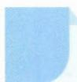

# 1 公式法

## 方法介绍

公式法,指应用公式解决问题的方法,包含对公式的直接应用、变形使用和拓展应用等,体现了人们数学化地思考与解决问题的过程.公式是纽带,沟通了数学中量与量之间的联系,而要运用好公式解决问题,需要理解公式的内涵,知晓公式的变形,明确公式的适用范围等.

![[高中/思维方法/高中数学思想方法导引2023版/01_公式法/典例示范/典例示范.md]]
![[高中/思维方法/高中数学思想方法导引2023版/01_公式法/巩固练习/巩固练习.md]]
