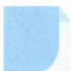

# 2 配方法

## 方法介绍

配方与展开是代数变形的两种基本形式.所谓配方法,是指对代数式进行定向变形(常常配成“完全平方”),通过恰当的配凑,使问题明了化、简单化,从而解决数学计算问题的方法.配方法使用的基本配方依据是二项式定理,一般地,“一元”问题只需一次配方即可,而“多元”问题常需多次配方,有整体配方、局部配方之分.

![[高中/思维方法/高中数学思想方法导引2023版/02_配方法/典例示范/典例示范.md]]
