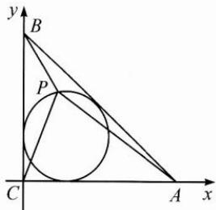

> [!faq]- 巩固练习答案
> **【答案】** 详见解析
>
> **【解析】**
> 建立函数关系，用配方法化归为一次函数区间上的最值问题.
> 如图建系，则 $A(8,0)$ , $B(0,6)$ , $C(0,0)$ ，其内切圆方程为 $(x-2)^{2}+(y-2)^{2}=4$ ，设 $P(x,y)$ 是圆上的动点，
> 则 $S=|PA|^{2}+|PB|^{2}+|PC|^{2}$ $=(x-8)^{2}+y^{2}+x^{2}+(y-6)^{2}+x^{2}+y^{2}$ $=3[(x-2)^{2}+(y-2)^{2}]-4x-76$ $=3\times4-4x+76=88-4x.$ 题目即求 S 在 [0,4] 上的最值，
> 由单调性得 $S_{max}=88, S_{min}=72.$
> 
